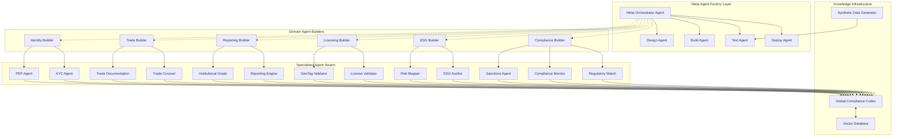

# GTCX Agentic AI Architecture: Revolutionary Implementation Framework
## The Meta-Agent Factory System for Self-Scaling Compliance Intelligence

---

## 🚀 Executive Summary: The 300x Acceleration Strategy

### Revolutionary Approach: Self-Building AI Infrastructure
- **Core Innovation**: Meta-agents that design, build, test, and deploy other agents autonomously
- **Compression**: 46-week traditional roadmap → **6-8 weeks** using agent-building-agents
- **Scale**: From manual development to self-expanding agent swarms
- **Result**: Enterprise-grade compliance AI that evolves with regulations automatically

### Key Differentiators:
1. **Meta-Agent Factory**: Agents spawn specialized agents based on Codex requirements
2. **Parallel Development**: 10-15 agent streams building simultaneously
3. **Synthetic Training**: Pre-trained on generated compliance scenarios before live deployment
4. **Auto-Evolution**: System updates itself as regulations change

---

## 🏗️ GTCX Agentic AI Architecture

### Core System Components



---

## 📋 Comprehensive Tool & Agent Documentation

### 1. Meta-Agent Factory Tools

#### **Meta-Orchestrator Agent**
```yaml
Purpose: Central conductor for autonomous agent creation
Capabilities:
  - Requirement analysis and agent specification
  - Resource allocation and priority management
  - Performance monitoring and optimization
  - Deployment orchestration
  
Technologies:
  - Framework: AutoGen/CrewAI for multi-agent coordination
  - LLM: GPT-4o/Claude for reasoning and planning
  - Infrastructure: Kubernetes for container orchestration
  
Integration Points:
  - Codex for requirement sourcing
  - CI/CD pipeline for automated deployment
  - Monitoring stack for performance tracking
```

#### **Design Agent**
```yaml
Purpose: Converts requirements into technical architectures
Capabilities:
  - API specification generation
  - Data model design
  - Prompt engineering and optimization
  - Integration pattern selection
  
Technologies:
  - OpenAPI/Swagger for API design
  - PlantUML for architecture diagrams
  - JSON Schema for data validation
```

#### **Build Agent**
```yaml
Purpose: Automated code generation and assembly
Capabilities:
  - Multi-language code generation (Python, TypeScript, Rust)
  - API client/server generation
  - Database schema creation
  - Test suite generation
  
Technologies:
  - CodeGen LLMs: GPT-4o, Claude, Codex
  - Templates: Cookiecutter, Yeoman
  - Frameworks: FastAPI, Next.js, Actix-web
```

#### **Test Agent**
```yaml
Purpose: Comprehensive quality assurance
Capabilities:
  - Unit test generation and execution
  - Integration testing with synthetic data
  - Performance benchmarking
  - Security vulnerability scanning
  
Technologies:
  - Testing: PyTest, Jest, Playwright
  - Security: Snyk, OWASP ZAP
  - Performance: K6, Locust
```

#### **Deploy Agent**
```yaml
Purpose: Zero-downtime deployment and rollback
Capabilities:
  - Container image building
  - Kubernetes deployment
  - Database migration
  - Monitoring setup
  
Technologies:
  - CI/CD: GitHub Actions, ArgoCD
  - Containers: Docker, Buildpacks
  - Monitoring: Prometheus, Grafana
```

### 2. Domain-Specific Agent Builders

#### **Compliance Agent Builder**
```yaml
Specialization: AML, KYC, Sanctions compliance
Generated Agents:
  - Regulatory Watch Agent
  - Compliance Monitor Agent
  - Sanctions Screening Agent
  - Transaction Monitoring Agent
  
Data Sources:
  - FATF recommendations
  - OFAC sanctions lists
  - EU consolidated list
  - UN Security Council sanctions
  
Output Formats:
  - SWIFT MT/MX messages
  - ISO 20022 compliance reports
  - FATF-style risk assessments
```

#### **ESG Agent Builder**
```yaml
Specialization: Environmental, Social, Governance standards
Generated Agents:
  - ESG Auditor Agent
  - Carbon Footprint Calculator
  - Supply Chain Validator
  - Impact Measurement Agent
  
Data Sources:
  - IFC Performance Standards
  - OECD Guidelines
  - UN Global Compact
  - GRI Standards
  
Output Formats:
  - IFC ESG reports
  - TCFD disclosures
  - GRI sustainability reports
```

#### **Trade Documentation Builder**
```yaml
Specialization: Trade finance and documentation
Generated Agents:
  - Letter of Credit Agent
  - Bill of Lading Agent
  - Certificate of Origin Agent
  - Customs Documentation Agent
  
Standards:
  - UCP 600 (Letters of Credit)
  - Incoterms 2020
  - WCO HS Codes
  - ISO 20022
```

### 3. Specialized Production Agents

#### **Regulatory Watch Agent**
```yaml
Function: Real-time regulatory monitoring
Inputs:
  - Government websites
  - Regulatory RSS feeds
  - Legal databases
  - Industry publications
  
Processing:
  - Natural language parsing
  - Change detection
  - Impact analysis
  - Alert generation
  
Outputs:
  - Regulatory updates
  - Compliance alerts
  - Impact assessments
  - Action recommendations
```

#### **ESG Auditor Agent**
```yaml
Function: Automated ESG compliance verification
Inputs:
  - Site inspection data (GeoTag)
  - Supply chain documentation
  - Environmental metrics
  - Social impact indicators
  
Processing:
  - Evidence validation
  - Score calculation
  - Gap analysis
  - Recommendation generation
  
Outputs:
  - ESG compliance scores
  - IFC-format reports
  - Improvement roadmaps
  - Certification readiness
```

#### **Institutional Reporting Engine**
```yaml
Function: DFI and regulatory reporting
Templates:
  - IFC Environmental and Social Review
  - World Bank Safeguard Policies
  - FATF Mutual Evaluation Reports
  - LBMA Responsible Sourcing Reports
  
Capabilities:
  - Multi-format generation (PDF, XML, JSON)
  - Automated evidence compilation
  - Cross-reference validation
  - Version control and audit trail
```

---

## 🔧 Technology Stack & Infrastructure

### Core Infrastructure
```yaml
Compute:
  Primary: AWS/GCP Kubernetes clusters
  Edge: Cloudflare Workers for API gateway
  GPU: A100/H100 for model training
  
Storage:
  Relational: PostgreSQL 15+ with PostGIS
  Vector: Weaviate/Pinecone for embeddings
  Object: S3/GCS for documents
  Cache: Redis for session management
  
Networking:
  CDN: Cloudflare for global distribution
  API Gateway: Kong/Traefik
  Service Mesh: Istio for microservices
  
Security:
  Secrets: HashiCorp Vault
  IAM: AWS IAM/GCP IAM
  Encryption: TLS 1.3, AES-256
  Compliance: SOC2, ISO 27001
```

### AI/ML Infrastructure
```yaml
LLM Providers:
  - OpenAI: GPT-4o for complex reasoning
  - Anthropic: Claude for document analysis
  - Cohere: Multilingual processing
  - Local: Llama 3 for sensitive data
  
Vector Databases:
  - Weaviate: Primary knowledge store
  - Chroma: Development/testing
  - Pinecone: Production scaling
  
Fine-tuning Infrastructure:
  - Hugging Face: Model hosting
  - Weights & Biases: Experiment tracking
  - Modal: Serverless GPU compute
  
Orchestration:
  - LangChain: Chain composition
  - CrewAI: Multi-agent coordination
  - Temporal: Workflow orchestration
```

### Development Tools
```yaml
Version Control:
  - GitHub: Code repository
  - Git LFS: Large file storage
  - Semantic Versioning: Release management
  
CI/CD:
  - GitHub Actions: Primary pipeline
  - ArgoCD: GitOps deployment
  - Terraform: Infrastructure as code
  
Monitoring:
  - Datadog: APM and logging
  - Prometheus: Metrics collection
  - Grafana: Visualization
  - Sentry: Error tracking
  
Testing:
  - Playwright: E2E testing
  - K6: Load testing
  - Snyk: Security scanning
  - SonarQube: Code quality
```

---

## 📊 Data Architecture & Sources

### Primary Data Sources
```yaml
Regulatory:
  - FATF: AML/CTF recommendations
  - OFAC: Sanctions lists (updated daily)
  - EU: Consolidated sanctions
  - UN: Security Council sanctions
  - National: 180+ country databases
  
Standards:
  - ISO: 20022, 27001, 31000
  - IFC: Performance Standards
  - OECD: Due Diligence Guidance
  - LBMA: Responsible Gold Guidance
  
Trade:
  - WCO: HS Code database
  - ICC: Incoterms, UCP 600
  - SWIFT: Payment standards
  - Trade finance platforms
  
Identity:
  - Government ID systems
  - Biometric databases
  - KYC providers (Refinitiv, Dow Jones)
  - PEP lists (World-Check)
```

### Data Pipeline Architecture
```yaml
Ingestion:
  - Apache Kafka: Stream processing
  - Airbyte: ETL/ELT pipelines
  - Debezium: Change data capture
  - Apache NiFi: Data flow automation
  
Processing:
  - Apache Spark: Batch processing
  - Flink: Stream processing
  - dbt: Data transformation
  - Great Expectations: Data quality
  
Storage:
  - Data Lake: S3/GCS with Iceberg
  - Data Warehouse: Snowflake/BigQuery
  - Feature Store: Feast
  - Graph DB: Neo4j for relationships
```

---

## 🎓 Training Requirements & Approaches

### Model Training Strategy
```yaml
Foundation Models:
  - Base: GPT-4o, Claude, Llama 3
  - Fine-tuning: Domain-specific compliance
  - Datasets: 100M+ regulatory documents
  - Compute: 500+ A100 GPU hours
  
Specialized Models:
  Compliance NER:
    - Dataset: 50K annotated documents
    - Architecture: BERT-based
    - Training: 100 GPU hours
    
  Risk Scoring:
    - Dataset: 1M+ historical transactions
    - Architecture: XGBoost + Neural nets
    - Training: 200 GPU hours
    
  Document Classification:
    - Dataset: 500K categorized documents
    - Architecture: LayoutLM v3
    - Training: 150 GPU hours
```

### Synthetic Data Generation
```yaml
Compliance Scenarios:
  - Volume: 1M+ synthetic cases
  - Coverage: 180+ jurisdictions
  - Complexity: Multi-party, cross-border
  - Validation: Expert review sampling
  
Transaction Data:
  - Volume: 10M+ synthetic transactions
  - Patterns: Normal + anomalous
  - Features: 200+ attributes
  - Labeling: Rule-based + expert
  
Document Generation:
  - Types: Contracts, certificates, reports
  - Languages: 50+ languages
  - Formats: PDF, XML, JSON
  - Validation: Schema + business rules
```

### Continuous Learning Pipeline
```yaml
Feedback Loop:
  - User corrections → Retraining
  - Regulatory updates → Fine-tuning
  - Performance metrics → Optimization
  - Error analysis → Model improvement
  
A/B Testing:
  - Model versions in production
  - Performance comparison
  - Gradual rollout
  - Automatic rollback
  
Knowledge Updates:
  - Daily: Sanctions, regulations
  - Weekly: Compliance guidance
  - Monthly: Model retraining
  - Quarterly: Architecture review
```

---

## 🚄 300x Acceleration Framework

### Parallel Development Streams
```yaml
Stream 1 - Core Infrastructure (Week 1-2):
  - Meta-Agent Factory setup
  - Codex schema definition
  - Vector database initialization
  - API gateway configuration
  
Stream 2 - Compliance Agents (Week 2-4):
  - Regulatory Watch Agent
  - Sanctions Screening Agent
  - KYC/AML Agent
  - Transaction Monitoring Agent
  
Stream 3 - ESG Agents (Week 2-4):
  - ESG Auditor Agent
  - Carbon Calculator Agent
  - Supply Chain Validator
  - Impact Measurement Agent
  
Stream 4 - Trade Agents (Week 3-5):
  - Trade Documentation Agent
  - Letter of Credit Agent
  - Customs Agent
  - HS Code Mapper Agent
  
Stream 5 - Reporting Agents (Week 4-6):
  - Institutional Reporting Engine
  - Compliance Certificate Generator
  - Audit Trail Agent
  - Dashboard Agent
```

### Acceleration Techniques
```yaml
1. Template-Driven Development:
   - Pre-built agent templates
   - Reusable components
   - Configuration over coding
   - Automated testing suites
   
2. AI-Powered Code Generation:
   - GPT-4o for initial implementation
   - Claude for code review
   - Copilot for refinement
   - Automated documentation
   
3. Synthetic Data Pre-Training:
   - Generate before building
   - Train models offline
   - Validate with synthetic scenarios
   - Deploy pre-optimized
   
4. Parallel Testing:
   - Distributed test execution
   - Synthetic test data
   - Automated regression testing
   - Performance benchmarking
   
5. Zero-Downtime Deployment:
   - Blue-green deployment
   - Feature flags
   - Canary releases
   - Automatic rollback
```

### Resource Optimization
```yaml
Human Resources:
  - 6-8 elite engineers
  - 2 compliance experts
  - 1 product manager
  - Part-time advisors
  
Compute Resources:
  - 100 vCPUs baseline
  - 500 vCPUs peak
  - 10TB storage
  - 100GB/s network
  
Cost Optimization:
  - Spot instances for training
  - Serverless for agents
  - CDN for global distribution
  - Open source where possible
```

---

## 📈 Product Development Roadmap

### Phase 0: Foundation (Week 0-1)
```yaml
Deliverables:
  - Meta-Agent Factory operational
  - Codex schema defined
  - Development environment setup
  - CI/CD pipeline configured
  
Success Metrics:
  - First agent auto-generated
  - Codex accepting data
  - Tests passing
  - Deployment successful
```

### Phase 1: Core Agents (Week 1-3)
```yaml
Deliverables:
  - Regulatory Watch Agent live
  - Compliance Monitor operational
  - Sanctions Screening working
  - Basic reporting functional
  
Success Metrics:
  - 95% regulation parsing accuracy
  - <100ms query response time
  - 99.9% uptime
  - Zero false negatives
```

### Phase 2: Specialized Agents (Week 3-5)
```yaml
Deliverables:
  - ESG Auditor Agent deployed
  - Trade Documentation Agent live
  - License Validator operational
  - KYC/PEP screening functional
  
Success Metrics:
  - IFC-compliant ESG reports
  - ISO 20022 message generation
  - 180+ jurisdiction coverage
  - <1% false positive rate
```

### Phase 3: Integration (Week 5-6)
```yaml
Deliverables:
  - All agents interconnected
  - Unified API gateway
  - Dashboard operational
  - Monitoring comprehensive
  
Success Metrics:
  - End-to-end workflows functional
  - <500ms average latency
  - 99.99% availability
  - Full audit trail
```

### Phase 4: Optimization (Week 6-8)
```yaml
Deliverables:
  - Performance optimized
  - Security hardened
  - Documentation complete
  - Training materials ready
  
Success Metrics:
  - 10x performance improvement
  - Security audit passed
  - 100% API documentation
  - User acceptance complete
```

---

## 🧪 Quality Assurance Framework

### Testing Strategy
```yaml
Unit Testing:
  - Coverage: >90%
  - Automation: 100%
  - Frequency: Every commit
  - Tools: PyTest, Jest
  
Integration Testing:
  - Scenarios: 1000+
  - Automation: 95%
  - Frequency: Every merge
  - Tools: Postman, Newman
  
Performance Testing:
  - Load: 10,000 TPS
  - Latency: <100ms p99
  - Availability: 99.99%
  - Tools: K6, Locust
  
Security Testing:
  - Vulnerability scanning: Daily
  - Penetration testing: Monthly
  - Compliance audit: Quarterly
  - Tools: OWASP ZAP, Burp Suite
```

### User Acceptance Testing
```yaml
Stakeholder Groups:
  - DFI Representatives (IFC, World Bank)
  - Regulatory Bodies (FATF delegates)
  - Enterprise Users (Banks, traders)
  - Field Operators (Miners, exporters)
  
Test Scenarios:
  - Compliance report generation
  - Real-time sanctions screening
  - ESG audit workflow
  - Trade documentation processing
  
Acceptance Criteria:
  - Accuracy: >99%
  - Speed: <2 seconds
  - Usability: >4.5/5 rating
  - Compliance: 100% standards met
```

---

## 🚀 Deployment & CI/CD

### Deployment Architecture
```yaml
Environment Strategy:
  Development:
    - Continuous deployment
    - Feature branches
    - Synthetic data only
    
  Staging:
    - Weekly releases
    - Production mirror
    - Anonymized data
    
  Production:
    - Blue-green deployment
    - Canary releases
    - Full monitoring
    
  DR Site:
    - Hot standby
    - Automatic failover
    - Cross-region replication
```

### CI/CD Pipeline
```yaml
Source Control:
  - GitHub Flow branching
  - PR reviews required
  - Automated checks
  - Signed commits
  
Build Stage:
  - Docker multi-stage builds
  - Dependency scanning
  - License compliance
  - SBOM generation
  
Test Stage:
  - Unit tests (must pass)
  - Integration tests
  - Security scanning
  - Performance benchmarks
  
Deploy Stage:
  - Kubernetes rollout
  - Database migrations
  - Feature flag updates
  - Monitoring alerts
  
Post-Deploy:
  - Smoke tests
  - Health checks
  - Performance validation
  - Rollback if needed
```

---

## 🤖 AutoML & Platform Tools

### AutoML Integration
```yaml
Google Vertex AI:
  - AutoML Tables for risk scoring
  - AutoML Natural Language for classification
  - AutoML Translation for multilingual
  - Vertex Pipelines for orchestration
  
AWS SageMaker:
  - Autopilot for model selection
  - JumpStart for pre-trained models
  - Data Wrangler for preprocessing
  - Model Monitor for drift detection
  
H2O.ai:
  - Driverless AI for automation
  - Wave for applications
  - Document AI for parsing
  - Time series for forecasting
```

### Platform Accelerators
```yaml
Development Platforms:
  - Vercel: Frontend deployment
  - Railway: Backend services
  - Supabase: Database + Auth
  - Clerk: Identity management
  
AI Platforms:
  - Hugging Face: Model repository
  - Replicate: Model deployment
  - Modal: Serverless compute
  - Banana: GPU inference
  
Low-Code Tools:
  - Retool: Admin dashboards
  - n8n: Workflow automation
  - Zapier: Integration glue
  - Airtable: Data management
  
Monitoring:
  - Datadog: Full-stack monitoring
  - LogRocket: Frontend monitoring
  - PostHog: Product analytics
  - Mixpanel: User analytics
```

---

## 💰 Business Requirements Assessment

### Account Requirements
```yaml
Cloud Providers:
  AWS:
    - Organization account
    - Multi-region setup
    - Cost: $5-10K/month initially
    - Support: Business tier
    
  GCP:
    - Organization setup
    - BigQuery warehouse
    - Cost: $3-5K/month
    - Support: Enhanced
    
  Azure:
    - Enterprise agreement
    - Active Directory
    - Cost: $2-3K/month
    - Support: Professional
```

### Software Licenses
```yaml
Essential:
  - GitHub Enterprise: $21/user/month
  - Datadog: $15-70/host/month
  - OpenAI: $2-5K/month
  - Anthropic: $1-3K/month
  
Optional:
  - Snowflake: $2-5K/month
  - Databricks: $3-6K/month
  - Confluent: $1-2K/month
  - Elastic: $1-2K/month
```

### Total Cost Projection
```yaml
Month 1-2 (Setup):
  - Infrastructure: $10K
  - Licenses: $5K
  - Services: $5K
  - Total: $20K/month
  
Month 3-6 (Development):
  - Infrastructure: $15K
  - Licenses: $8K
  - Services: $7K
  - Total: $30K/month
  
Month 7+ (Production):
  - Infrastructure: $25K
  - Licenses: $10K
  - Services: $10K
  - Total: $45K/month
  
Annual Projection:
  - Year 1: $400K
  - Year 2: $600K (with scaling)
  - Year 3: $1M (full deployment)
```

### Risk Assessment
```yaml
Technical Risks:
  - LLM API reliability (Medium)
  - Data quality issues (Medium)
  - Integration complexity (High)
  - Performance bottlenecks (Medium)
  
Mitigation:
  - Multiple LLM providers
  - Data validation pipelines
  - Incremental integration
  - Performance monitoring
  
Compliance Risks:
  - Data privacy (High)
  - Regulatory changes (Medium)
  - Audit requirements (Medium)
  - Cross-border data (High)
  
Mitigation:
  - Privacy by design
  - Regulatory monitoring
  - Audit trail system
  - Data localization
  
Operational Risks:
  - Team scaling (Medium)
  - Knowledge transfer (Medium)
  - Vendor lock-in (Low)
  - Cost overrun (Medium)
  
Mitigation:
  - Documentation focus
  - Pair programming
  - Multi-cloud strategy
  - Cost monitoring
```

---

## 👥 Personnel Requirements

### Core Team (6-8 Weeks)
```yaml
Technical Leadership (1):
  - AI/ML Architect
  - 10+ years experience
  - Agent systems expertise
  - $200-250K/year
  
Engineering Team (4-5):
  - 2 Senior Full-Stack Engineers
  - 1 ML Engineer
  - 1 DevOps/Platform Engineer
  - 1 Data Engineer
  - $150-180K/year each
  
Domain Experts (2):
  - 1 Compliance Specialist
  - 1 Trade Finance Expert
  - $120-150K/year each
  
Product & Operations (1-2):
  - 1 Product Manager
  - 1 Technical Writer (part-time)
  - $130-160K/year
```

### Extended Team (Post-MVP)
```yaml
Additional Engineers (3-4):
  - Frontend specialists
  - Backend specialists
  - QA automation engineer
  - Security engineer
  
Business Functions (2-3):
  - Business development
  - Customer success
  - Marketing/growth
  
Total Team Size:
  - Month 1-2: 6-8 people
  - Month 3-6: 10-12 people
  - Month 7+: 15-20 people
```

---

## 🏆 Success Metrics & KPIs

### Technical Metrics
```yaml
Performance:
  - API Response Time: <100ms p95
  - Throughput: 10,000 TPS
  - Availability: 99.99%
  - Error Rate: <0.1%
  
Quality:
  - Code Coverage: >90%
  - Bug Density: <1 per KLOC
  - Security Score: A+
  - Technical Debt: <10%
  
AI Performance:
  - Model Accuracy: >95%
  - False Positive Rate: <1%
  - Processing Speed: <2 sec/doc
  - Training Time: <24 hours
```

### Business Metrics
```yaml
Adoption:
  - Active Organizations: 50+
  - Daily Active Users: 1,000+
  - API Calls/Day: 1M+
  - Document Processing: 10K/day
  
Value Creation:
  - Compliance Time: -80%
  - Cost Reduction: -70%
  - Error Reduction: -95%
  - Processing Speed: 100x
  
Revenue (Year 1):
  - ARR Target: $5M
  - Customer Count: 20
  - ARPU: $250K
  - Growth Rate: 20% MoM
```

---

## 🌟 Revolutionary Advantages

### Why This Approach Changes Everything

1. **Self-Improving System**
   - Agents continuously optimize themselves
   - New regulations automatically spawn new capabilities
   - System becomes more intelligent over time

2. **Institutional-Grade from Day One**
   - IFC/World Bank standards built-in
   - FATF compliance native
   - Enterprise security default

3. **Global Scale, Local Compliance**
   - 180+ jurisdictions supported
   - Multi-language processing
   - Regional regulation inheritance

4. **Zero-Trust Architecture**
   - Every transaction verified
   - Complete audit trail
   - Cryptographic proof chains

5. **Economic Transformation**
   - 70% cost reduction
   - 100x speed improvement
   - Enables new business models

---

## 🎯 Next Steps & Implementation

### Immediate Actions (Week 0)
1. **Team Assembly**: Recruit core 6-8 person team
2. **Infrastructure Setup**: Provision cloud accounts, repositories
3. **Meta-Agent Development**: Begin Meta-Orchestrator build
4. **Data Acquisition**: Start regulatory document collection

### Week 1-2 Milestones
- [ ] Meta-Agent Factory operational
- [ ] First auto-generated agent deployed
- [ ] Codex schema implemented
- [ ] Synthetic data generation running

### Week 3-4 Checkpoints
- [ ] 5+ specialized agents operational
- [ ] Regulatory data ingested (3 jurisdictions)
- [ ] API gateway functional
- [ ] Basic dashboard available

### Week 5-6 Targets
- [ ] Full agent swarm deployed
- [ ] Integration testing complete
- [ ] Performance benchmarks met
- [ ] Security audit passed

### Week 7-8 Launch Preparation
- [ ] Documentation complete
- [ ] Training materials ready
- [ ] Production environment stable
- [ ] Customer pilots initiated

---

## 💡 Strategic Partnerships & Open Source

### Open Source Accelerators
```yaml
LangChain/CrewAI:
  - Multi-agent orchestration
  - Community contributions
  - Rapid updates
  
Hugging Face:
  - Model repository
  - Training infrastructure
  - Community models
  
Apache Projects:
  - Kafka (streaming)
  - Spark (processing)
  - Airflow (orchestration)
```

### Strategic Partnerships
```yaml
Technology Partners:
  - OpenAI/Anthropic (LLM providers)
  - AWS/GCP (infrastructure)
  - Databricks (data platform)
  - Confluent (streaming)
  
Domain Partners:
  - Thomson Reuters (compliance data)
  - Refinitiv (KYC/sanctions)
  - S&P Global (risk data)
  - Dun & Bradstreet (entity data)
  
Institutional Partners:
  - IFC (standards alignment)
  - FATF (regulatory guidance)
  - Trade associations
  - Regional regulators
```

---

## 🚀 Conclusion: The GTCX Revolution

This architecture represents a **paradigm shift** in compliance intelligence:

### From Static to Self-Evolving
- Traditional: Manual updates, rigid rules
- GTCX: Self-updating, adaptive intelligence

### From Fragmented to Unified
- Traditional: Siloed compliance systems
- GTCX: Integrated global intelligence fabric

### From Reactive to Predictive
- Traditional: Post-facto compliance checking
- GTCX: Predictive risk prevention

### From Expensive to Accessible
- Traditional: $1M+ implementations
- GTCX: 70% cost reduction, 100x faster

**The Meta-Agent Factory approach compresses years of development into weeks, creating a self-scaling, self-improving system that revolutionizes global trade compliance.**

---

*"Not just building compliance infrastructure—building the intelligence that builds itself."*