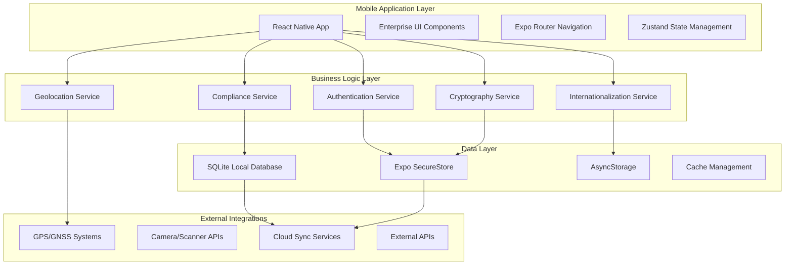

# GeoTag™ System Architecture

## Document Information
- **Version**: 2.1.0
- **Date**: January 2025
- **Classification**: Technical Specification
- **Audience**: Engineering Teams, System Architects, Technical Decision Makers

## Table of Contents
1. [Architecture Overview](#architecture-overview)
2. [System Components](#system-components)
3. [Data Architecture](#data-architecture)
4. [Security Architecture](#security-architecture)
5. [Integration Architecture](#integration-architecture)
6. [Scalability & Performance](#scalability--performance)
7. [Deployment Architecture](#deployment-architecture)
8. [Disaster Recovery](#disaster-recovery)

## Architecture Overview

### High-Level Architecture Diagram



### Architecture Principles

#### 1. Offline-First Design
- **Principle**: Application must function without network connectivity
- **Implementation**: Local SQLite database with sync capabilities
- **Benefits**: Reliable operation in remote mining locations

#### 2. Security by Design
- **Principle**: Security integrated at every architectural layer
- **Implementation**: End-to-end encryption, cryptographic signatures
- **Benefits**: Institutional-grade data protection

#### 3. Mobile-First Architecture
- **Principle**: Optimized for mobile device constraints
- **Implementation**: Efficient memory usage, battery optimization
- **Benefits**: Superior mobile user experience

#### 4. Modular Service Architecture
- **Principle**: Loosely coupled, highly cohesive services
- **Implementation**: Independent service modules with clean interfaces
- **Benefits**: Maintainable, testable, scalable codebase

## System Components

### 1. Presentation Layer

#### React Native Application
```typescript
// Core Application Structure
export interface ApplicationArchitecture {
  framework: 'React Native 0.73+';
  router: 'Expo Router v5+';
  language: 'TypeScript 5.0+';
  ui: 'Custom Enterprise Design System';
  navigation: 'File-based routing with tabs';
}
```

**Key Characteristics:**
- Cross-platform iOS/Android deployment
- Native performance with JavaScript flexibility
- Hot reloading for rapid development
- Over-the-air updates via Expo Updates

#### Enterprise UI Component Library
```typescript
// Enterprise Component System
export interface EnterpriseComponents {
  theming: 'Dynamic light/dark mode support';
  accessibility: 'WCAG 2.1 AA compliance';
  internationalization: 'RTL language support';
  responsiveness: 'Adaptive layouts for all devices';
}
```

### 2. Business Logic Layer

#### Authentication Service
```typescript
interface AuthenticationService {
  biometricAuth(): Promise<AuthResult>;
  multiFactorAuth(): Promise<MFAResult>;
  sessionManagement(): SessionManager;
  roleBasedAccess(): RBACManager;
}
```

**Features:**
- Biometric authentication (Face ID, Touch ID, Fingerprint)
- Multi-factor authentication support
- Role-based access control (RBAC)
- Secure session management with automatic timeout

#### Cryptography Service
```typescript
interface CryptographyService {
  generateKeyPair(): Ed25519KeyPair;
  signDocument(data: Uint8Array): Signature;
  verifySignature(data: Uint8Array, signature: Signature): boolean;
  generateQRCode(data: CertificateData): QRCodeResult;
}
```

**Cryptographic Standards:**
- **Digital Signatures**: Ed25519 elliptic curve cryptography
- **Hashing**: BLAKE3 for performance, SHA-256 for compatibility
- **Random Number Generation**: Cryptographically secure PRNG
- **Key Derivation**: PBKDF2 with high iteration count

#### Geolocation Service
```typescript
interface GeolocationService {
  getCurrentPosition(): Promise<HighPrecisionLocation>;
  startTracking(): LocationTracker;
  validateGeofence(location: Location, zone: GeofenceZone): boolean;
  calculateAccuracy(): AccuracyMetrics;
}
```

**Location Capabilities:**
- **Precision**: Sub-meter accuracy with WAAS/EGNOS
- **Coordinate Systems**: Decimal degrees, DMS, UTM
- **Offline Maps**: Cached map tiles for remote areas
- **Geofencing**: Automated compliance zone verification

### 3. Data Architecture

#### Local Database Schema
```sql
-- Core data structure
CREATE TABLE mining_operations (
    id TEXT PRIMARY KEY,
    user_id TEXT NOT NULL,
    location_lat REAL NOT NULL,
    location_lng REAL NOT NULL,
    timestamp INTEGER NOT NULL,
    signature TEXT NOT NULL,
    status TEXT NOT NULL,
    encrypted_data BLOB,
    created_at INTEGER DEFAULT (strftime('%s', 'now')),
    updated_at INTEGER DEFAULT (strftime('%s', 'now'))
);

CREATE TABLE certificates (
    id TEXT PRIMARY KEY,
    operation_id TEXT NOT NULL,
    certificate_type TEXT NOT NULL,
    issuer TEXT NOT NULL,
    signature TEXT NOT NULL,
    qr_code_data TEXT,
    expiry_date INTEGER,
    created_at INTEGER DEFAULT (strftime('%s', 'now')),
    FOREIGN KEY (operation_id) REFERENCES mining_operations(id)
);

CREATE TABLE compliance_records (
    id TEXT PRIMARY KEY,
    operation_id TEXT NOT NULL,
    compliance_type TEXT NOT NULL,
    status TEXT NOT NULL CHECK (status IN ('compliant', 'non-compliant', 'pending')),
    inspector_id TEXT,
    notes TEXT,
    created_at INTEGER DEFAULT (strftime('%s', 'now')),
    FOREIGN KEY (operation_id) REFERENCES mining_operations(id)
);
```

#### Data Security
- **Encryption at Rest**: AES-256 encryption for sensitive data
- **Field-Level Encryption**: Selective encryption of PII fields
- **Database Integrity**: SQLite WAL mode with checksums
- **Backup Encryption**: End-to-end encrypted backups

### 4. Security Architecture

#### Defense in Depth Strategy
```typescript
interface SecurityLayers {
  device: 'Hardware security module integration';
  application: 'Code obfuscation and anti-tampering';
  network: 'Certificate pinning and encrypted transport';
  data: 'End-to-end encryption with forward secrecy';
  identity: 'Multi-factor authentication and biometrics';
}
```

#### Threat Model
| Threat Category | Risk Level | Mitigation Strategy |
|----------------|------------|-------------------|
| Data Theft | High | End-to-end encryption, secure storage |
| Man-in-the-Middle | Medium | Certificate pinning, TLS 1.3 |
| Device Compromise | High | Hardware security, biometric auth |
| Insider Threat | Medium | Role-based access, audit logging |
| Social Engineering | Medium | User education, security awareness |

## Integration Architecture

### External System Integrations

#### Government Regulatory Systems
```typescript
interface RegulatoryIntegration {
  submitCompliance(data: ComplianceData): Promise<SubmissionResult>;
  validateLicense(licenseId: string): Promise<LicenseStatus>;
  retrieveRegulations(jurisdiction: string): Promise<RegulationSet>;
  reportViolation(violation: ViolationReport): Promise<ReportResult>;
}
```

#### Mining Industry Partners
```typescript
interface IndustryIntegration {
  verifySupplyChain(goldLot: GoldLot): Promise<ChainVerification>;
  submitAssayResults(results: AssayData): Promise<CertificationResult>;
  updateMarketPrices(): Promise<PriceData>;
  notifyStakeholders(event: MiningEvent): Promise<NotificationResult>;
}
```

### API Architecture

#### RESTful API Design
```typescript
// API Endpoint Structure
interface APIEndpoints {
  '/api/v2/operations': OperationsAPI;
  '/api/v2/certificates': CertificatesAPI;
  '/api/v2/compliance': ComplianceAPI;
  '/api/v2/users': UsersAPI;
  '/api/v2/locations': LocationsAPI;
}

// Standard HTTP Response Format
interface APIResponse<T> {
  success: boolean;
  data?: T;
  error?: {
    code: string;
    message: string;
    details?: unknown;
  };
  timestamp: string;
  requestId: string;
}
```

#### GraphQL Schema (Future Implementation)
```graphql
type Query {
  miningOperations(filter: OperationFilter): [MiningOperation!]!
  certificates(operationId: ID!): [Certificate!]!
  complianceStatus(operationId: ID!): ComplianceStatus!
}

type Mutation {
  createMiningOperation(input: MiningOperationInput!): MiningOperation!
  updateComplianceStatus(input: ComplianceStatusInput!): ComplianceStatus!
  generateCertificate(input: CertificateInput!): Certificate!
}

type Subscription {
  operationUpdates(operationId: ID!): MiningOperation!
  complianceAlerts(userId: ID!): ComplianceAlert!
}
```

## Scalability & Performance

### Performance Requirements
| Metric | Target | Measurement |
|--------|--------|-------------|
| App Launch Time | < 3 seconds | Cold start to interactive |
| Location Acquisition | < 5 seconds | GPS fix to ±3m accuracy |
| Database Query | < 100ms | 95th percentile response |
| UI Responsiveness | 60 FPS | Smooth scrolling and animations |
| Memory Usage | < 150MB | Peak memory on mid-range devices |
| Battery Impact | < 5% per hour | Background GPS tracking |

### Scalability Architecture
```typescript
interface ScalabilityFeatures {
  dataPartitioning: 'Time-based and geographic partitioning';
  caching: 'Multi-level caching with LRU eviction';
  compression: 'Data compression for network and storage';
  lazyLoading: 'On-demand loading of components and data';
  virtualization: 'Virtual scrolling for large datasets';
}
```

### Performance Optimization Strategies
1. **Code Splitting**: Dynamic imports for feature modules
2. **Image Optimization**: WebP format with lazy loading
3. **Database Indexing**: Strategic indexes on frequently queried fields
4. **Bundle Optimization**: Tree shaking and dead code elimination
5. **Memory Management**: Proper cleanup and garbage collection

## Deployment Architecture

### Mobile Application Deployment
```yaml
# Deployment Pipeline Configuration
deployment:
  development:
    platform: Expo Go
    updates: Hot reloading enabled
    debugging: Full debug symbols
    
  staging:
    platform: EAS Build
    updates: Over-the-air enabled
    testing: Automated testing suite
    
  production:
    platform: App Store / Google Play
    updates: Staged rollout
    monitoring: Full telemetry enabled
```

### Infrastructure Requirements
```typescript
interface InfrastructureSpec {
  mobile: {
    ios: 'iOS 13.0+ (iPhone 6s and newer)';
    android: 'Android 8.0+ (API Level 26+)';
    storage: '2GB minimum, 8GB recommended';
    memory: '3GB RAM minimum, 6GB recommended';
  };
  server: {
    architecture: 'Microservices on Kubernetes';
    database: 'PostgreSQL with read replicas';
    cache: 'Redis cluster';
    cdn: 'Global CDN for static assets';
  };
}
```

## Disaster Recovery

### Backup Strategy
```typescript
interface BackupStrategy {
  frequency: 'Real-time for critical data, daily for archives';
  retention: '7 years for compliance data, 1 year for operational';
  encryption: 'AES-256 with customer-managed keys';
  geographic: 'Multi-region backup distribution';
  testing: 'Monthly restore testing with validation';
}
```

### Business Continuity Plan
1. **RTO (Recovery Time Objective)**: 4 hours for critical systems
2. **RPO (Recovery Point Objective)**: 15 minutes maximum data loss
3. **Failover Strategy**: Automated failover with health checks
4. **Communication Plan**: Stakeholder notification within 30 minutes
5. **Post-Incident Review**: Comprehensive analysis and improvement

### Monitoring & Alerting
```typescript
interface MonitoringStack {
  applicationPerformance: 'Real-time APM with distributed tracing';
  infrastructure: 'Infrastructure monitoring with predictive alerts';
  security: 'Security incident detection and response';
  compliance: 'Regulatory compliance monitoring dashboard';
  userExperience: 'Real user monitoring and analytics';
}
```

---

**Document Control:**
- **Author**: GeoTag™ Architecture Team
- **Reviewer**: Chief Technology Officer  
- **Approval**: Chief Information Security Officer
- **Next Review**: July 2025
- **Distribution**: Engineering, Operations, Security Teams

**Classification: CONFIDENTIAL**  
*This document contains proprietary and confidential information of GeoTag™. Unauthorized distribution is prohibited.*