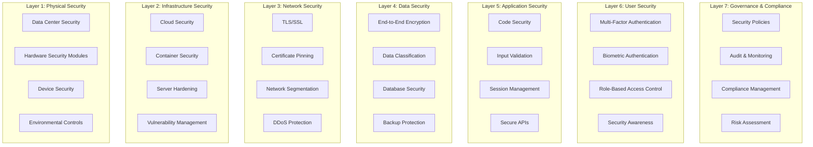

# GeoTag™ Security Framework

## Document Information
- **Version**: 2.1.0
- **Date**: January 2025
- **Classification**: CONFIDENTIAL
- **Security Level**: Level 3 - Restricted Access
- **Audience**: Security Team, DevOps, Senior Engineering

## Executive Summary

GeoTag™ implements a comprehensive, defense-in-depth security architecture designed to protect sensitive mining data, financial transactions, and regulatory compliance information. This framework adheres to international security standards including ISO 27001, SOC 2, and industry-specific regulations for the mining and precious metals sectors.

## Table of Contents
1. [Security Architecture](#security-architecture)
2. [Threat Model](#threat-model)
3. [Cryptographic Framework](#cryptographic-framework)
4. [Authentication & Authorization](#authentication--authorization)
5. [Data Protection](#data-protection)
6. [Network Security](#network-security)
7. [Application Security](#application-security)
8. [Infrastructure Security](#infrastructure-security)
9. [Compliance & Governance](#compliance--governance)
10. [Incident Response](#incident-response)

## Security Architecture

### Defense-in-Depth Strategy



### Security Principles

#### 1. Zero Trust Architecture
- **Never Trust, Always Verify**: No implicit trust based on network location
- **Least Privilege Access**: Minimum required access for each user/service
- **Continuous Verification**: Ongoing authentication and authorization checks

#### 2. Privacy by Design
- **Data Minimization**: Collect only necessary data
- **Purpose Limitation**: Use data only for stated purposes
- **Storage Limitation**: Retain data only as long as necessary

#### 3. Security by Default
- **Secure Configuration**: Default settings prioritize security
- **Fail Secure**: System defaults to secure state on failure
- **Progressive Security**: Security increases with risk level

## Threat Model

### Threat Assessment Matrix

| Threat Category | Likelihood | Impact | Risk Level | Mitigation Priority |
|----------------|------------|--------|------------|-------------------|
| **Data Breach** | Medium | Critical | High | Critical |
| **Insider Threat** | Low | High | Medium | High |
| **Nation-State Attack** | Low | Critical | Medium | High |
| **Ransomware** | Medium | High | High | Critical |
| **Supply Chain Attack** | Low | High | Medium | Medium |
| **Social Engineering** | High | Medium | High | High |
| **Device Theft** | High | Medium | High | High |
| **Cryptographic Attack** | Low | Critical | Medium | Medium |

### Threat Actors

#### External Threats
```typescript
interface ExternalThreats {
  cybercriminals: {
    motivation: 'Financial gain through data theft or ransomware';
    capabilities: 'Medium to high technical skills';
    methods: ['Phishing', 'Malware', 'Social Engineering'];
  };
  nationStates: {
    motivation: 'Economic espionage, resource intelligence';
    capabilities: 'Advanced persistent threat capabilities';
    methods: ['Zero-day exploits', 'Supply chain attacks', 'Advanced malware'];
  };
  competitors: {
    motivation: 'Industrial espionage, market advantage';
    capabilities: 'Medium technical skills, insider knowledge';
    methods: ['Corporate espionage', 'Bribery', 'Data exfiltration'];
  };
}
```

#### Internal Threats
```typescript
interface InternalThreats {
  maliciousInsiders: {
    risk: 'High - privileged access to sensitive data';
    mitigation: ['RBAC', 'Activity monitoring', 'Background checks'];
  };
  negligentInsiders: {
    risk: 'Medium - accidental data exposure';
    mitigation: ['Security training', 'DLP systems', 'Access controls'];
  };
  compromisedAccounts: {
    risk: 'High - legitimate access used maliciously';
    mitigation: ['MFA', 'Behavioral analytics', 'Session monitoring'];
  };
}
```

## Cryptographic Framework

### Cryptographic Standards

#### Digital Signatures
```typescript
interface DigitalSignatureSpec {
  algorithm: 'Ed25519';
  keySize: 256; // bits
  hashFunction: 'BLAKE3';
  purpose: 'Document integrity and non-repudiation';
  keyGeneration: {
    entropy: 'Hardware-based true random number generator';
    storage: 'Hardware Security Module or Secure Enclave';
    rotation: 'Annual key rotation for high-value operations';
  };
}
```

#### Symmetric Encryption
```typescript
interface SymmetricEncryptionSpec {
  algorithm: 'AES-256-GCM';
  keySize: 256; // bits
  mode: 'Galois/Counter Mode (authenticated encryption)';
  ivGeneration: 'Cryptographically secure random';
  keyDerivation: {
    function: 'PBKDF2';
    iterations: 100000;
    salt: 'Unique random salt per key derivation';
  };
}
```

#### Key Management
```typescript
interface KeyManagementFramework {
  hierarchy: {
    masterKey: 'Hardware Security Module (HSM)';
    dataEncryptionKeys: 'Derived from master key';
    sessionKeys: 'Ephemeral keys for temporary operations';
  };
  lifecycle: {
    generation: 'Hardware-based entropy source';
    distribution: 'Secure key exchange protocols';
    storage: 'Encrypted key storage with access controls';
    rotation: 'Regular rotation based on usage and time';
    destruction: 'Cryptographic erasure and physical destruction';
  };
  escrow: {
    enabled: true;
    custodian: 'Independent third-party key escrow service';
    conditions: 'Legal compliance and business continuity only';
  };
}
```

### Certificate Management
```typescript
interface CertificateAuthority {
  rootCA: {
    algorithm: 'ECDSA P-384';
    validity: '10 years';
    storage: 'Air-gapped HSM';
    backup: 'Geographically distributed secure facilities';
  };
  intermediateCA: {
    algorithm: 'ECDSA P-256';
    validity: '5 years';
    usage: 'Issue end-entity certificates';
  };
  endEntityCerts: {
    validity: '2 years';
    revocation: 'OCSP with CRL fallback';
    transparencyLogging: 'Certificate Transparency compliance';
  };
}
```

## Authentication & Authorization

### Multi-Factor Authentication (MFA)

#### Authentication Factors
```typescript
interface AuthenticationFactors {
  knowledge: {
    passwords: {
      policy: 'Minimum 12 characters, complexity requirements';
      storage: 'bcrypt with salt, minimum 12 rounds';
      rotation: 'Mandatory 90-day rotation for privileged accounts';
    };
    securityQuestions: {
      enabled: false; // Deprecated due to security weaknesses
      replacement: 'Hardware security keys or biometric methods';
    };
  };
  
  possession: {
    hardwareTokens: {
      standard: 'FIDO2/WebAuthn';
      fallback: 'TOTP (RFC 6238)';
      vendor: 'YubiKey or equivalent certified devices';
    };
    mobileDevice: {
      pushNotifications: 'Encrypted push with device verification';
      smsBackup: 'Last resort only, not for high-value operations';
    };
  };
  
  inherence: {
    biometrics: {
      faceID: 'iOS Face ID with liveness detection';
      touchID: 'iOS Touch ID and Android fingerprint';
      storage: 'Local secure enclave only, never server-side';
    };
  };
}
```

#### Role-Based Access Control (RBAC)
```typescript
interface RBACFramework {
  roles: {
    'small-scale-miner': {
      permissions: [
        'create:mining-operation',
        'read:own-operations',
        'update:own-operations',
        'upload:documentation'
      ];
      constraints: {
        geographicScope: 'Assigned mining concession only';
        timeRestrictions: 'Business hours only';
        dataAccess: 'Own records and public regulatory information';
      };
    };
    
    'government-inspector': {
      permissions: [
        'read:all-operations',
        'create:inspection-report',
        'update:compliance-status',
        'approve:certificates',
        'access:regulatory-tools'
      ];
      constraints: {
        geographicScope: 'Assigned jurisdiction';
        auditLogging: 'All actions logged and monitored';
        dataAccess: 'Operations within jurisdiction';
      };
    };
    
    'gold-trader': {
      permissions: [
        'read:certificates',
        'verify:chain-of-custody',
        'create:purchase-records',
        'access:market-data'
      ];
      constraints: {
        transactionLimits: 'Daily transaction value limits';
        kycRequirements: 'Enhanced KYC for high-value transactions';
        monitoringLevel: 'Enhanced transaction monitoring';
      };
    };
  };
  
  attributes: {
    clearanceLevel: ['public', 'restricted', 'confidential', 'secret'];
    dataClassification: ['public', 'internal', 'confidential', 'restricted'];
    geographicScope: ['global', 'regional', 'national', 'local'];
  };
}
```

### Session Management
```typescript
interface SessionSecurity {
  tokenFormat: 'JWT with additional security claims';
  storage: 'HttpOnly cookies with Secure and SameSite flags';
  expiration: {
    accessToken: '15 minutes';
    refreshToken: '7 days';
    sessionTimeout: '30 minutes of inactivity';
  };
  security: {
    tokenRotation: 'Refresh token rotation on each use';
    deviceBinding: 'Tokens bound to specific device fingerprints';
    geolocationBinding: 'Unusual location triggers re-authentication';
    concurrentSessions: 'Maximum 3 active sessions per user';
  };
}
```

## Data Protection

### Data Classification

#### Classification Levels
```typescript
interface DataClassification {
  public: {
    examples: ['Marketing materials', 'Public regulatory information'];
    protection: 'Standard web security measures';
    retention: 'Indefinite';
  };
  
  internal: {
    examples: ['Employee directories', 'Internal policies'];
    protection: 'Access controls, audit logging';
    retention: '7 years default';
  };
  
  confidential: {
    examples: ['Mining operation data', 'Financial records', 'User PII'];
    protection: 'Encryption at rest and in transit, strict access controls';
    retention: '7-10 years (regulatory requirements)';
  };
  
  restricted: {
    examples: ['Government inspection reports', 'High-value trade data'];
    protection: 'HSM encryption, enhanced access controls, real-time monitoring';
    retention: 'Regulatory requirements plus legal hold provisions';
  };
}
```

### Encryption Standards

#### Data at Rest
```typescript
interface DataAtRestEncryption {
  database: {
    encryption: 'AES-256 Transparent Data Encryption (TDE)';
    keyManagement: 'Customer-managed keys in HSM';
    columnLevel: 'AES-256-GCM for PII fields';
  };
  
  fileStorage: {
    encryption: 'AES-256-GCM with authenticated encryption';
    keyRotation: 'Annual key rotation';
    metadata: 'Encrypted metadata for sensitive files';
  };
  
  backups: {
    encryption: 'AES-256-GCM with separate backup keys';
    keyEscrow: 'Escrowed backup keys for disaster recovery';
    verification: 'Regular backup integrity verification';
  };
  
  mobile: {
    localStorage: 'Platform-provided secure storage (Keychain/Keystore)';
    database: 'SQLCipher with AES-256 encryption';
    keyDerivation: 'Device-specific key derivation';
  };
}
```

#### Data in Transit
```typescript
interface DataInTransitEncryption {
  api: {
    protocol: 'TLS 1.3 minimum';
    cipherSuites: [
      'TLS_AES_256_GCM_SHA384',
      'TLS_CHACHA20_POLY1305_SHA256',
      'TLS_AES_128_GCM_SHA256'
    ];
    certificatePinning: 'HPKP with backup pins';
    hsts: 'HTTP Strict Transport Security with preload';
  };
  
  internal: {
    serviceToService: 'mTLS with certificate-based authentication';
    messageQueues: 'End-to-end encryption for sensitive messages';
    logging: 'Encrypted log transmission';
  };
  
  mobile: {
    certificatePinning: 'Primary and backup certificate pins';
    networkSecurity: 'Network Security Config (Android) / ATS (iOS)';
    fallbackPrevention: 'Disable HTTP fallback';
  };
}
```

### Data Loss Prevention (DLP)
```typescript
interface DLPStrategy {
  contentInspection: {
    patterns: ['SSN', 'Credit cards', 'Mining coordinates', 'Certificate numbers'];
    methods: ['Regex patterns', 'Machine learning classification'];
    realTime: 'Real-time content analysis on data movement';
  };
  
  policies: {
    emailSecurity: 'Block sensitive data in email attachments';
    fileSharing: 'Restrict sharing of confidential documents';
    printSecurity: 'Watermarking and audit trails for printed documents';
    usbRestrictions: 'Block USB transfers of sensitive data';
  };
  
  monitoring: {
    userActivity: 'Monitor unusual data access patterns';
    dataMovement: 'Track large data transfers';
    exfiltrationDetection: 'AI-based exfiltration detection';
  };
}
```

## Network Security

### Network Architecture
```typescript
interface NetworkSecurity {
  segmentation: {
    dmz: 'Public-facing services isolated from internal network';
    internal: 'Internal services with micro-segmentation';
    management: 'Separate management network for infrastructure';
    backup: 'Isolated backup network';
  };
  
  firewalls: {
    perimeter: 'Next-generation firewall with deep packet inspection';
    internal: 'Micro-segmentation with zero-trust policies';
    application: 'Web application firewall for API protection';
  };
  
  monitoring: {
    ids: 'Intrusion Detection System with behavioral analysis';
    ips: 'Intrusion Prevention System with automated response';
    siem: 'Security Information and Event Management';
    netflow: 'Network flow analysis for anomaly detection';
  };
}
```

### API Security
```typescript
interface APISecurityFramework {
  authentication: {
    oauth2: 'OAuth 2.0 with PKCE for mobile applications';
    apiKeys: 'API keys for server-to-server communication';
    jwt: 'JSON Web Tokens with short expiration';
  };
  
  rateLimit: {
    perUser: '1000 requests per hour';
    perIP: '10000 requests per hour';
    perEndpoint: 'Endpoint-specific rate limiting';
    burstControl: 'Token bucket algorithm for burst handling';
  };
  
  validation: {
    inputValidation: 'Schema-based input validation';
    outputEncoding: 'Context-aware output encoding';
    sqlInjection: 'Parameterized queries and ORM';
    xss: 'Content Security Policy and output sanitization';
  };
  
  monitoring: {
    apiGateway: 'Centralized API gateway with logging';
    anomalyDetection: 'ML-based API usage anomaly detection';
    threatIntelligence: 'Integration with threat intelligence feeds';
  };
}
```

## Application Security

### Secure Development Lifecycle (SDLC)

#### Security Requirements
```typescript
interface SecurityRequirements {
  designPhase: {
    threatModeling: 'STRIDE methodology for threat identification';
    securityArchitecture: 'Security architecture review and approval';
    privacyImpact: 'Privacy impact assessment for data handling';
  };
  
  developmentPhase: {
    secureCode: 'OWASP secure coding guidelines';
    staticAnalysis: 'Automated static code analysis (SonarQube, Checkmarx)';
    dependencyScanning: 'Third-party dependency vulnerability scanning';
  };
  
  testingPhase: {
    securityTesting: 'OWASP ZAP and manual penetration testing';
    dynamicAnalysis: 'Runtime security testing (IAST/DAST)';
    fuzzTesting: 'Input fuzzing for vulnerability discovery';
  };
  
  deploymentPhase: {
    secureDeployment: 'Secure configuration verification';
    containerSecurity: 'Container image security scanning';
    infrastructureSecurity: 'Infrastructure as Code security validation';
  };
}
```

#### Code Security Standards
```typescript
interface CodeSecurityStandards {
  inputValidation: {
    sanitization: 'All user inputs sanitized and validated';
    whitelisting: 'Whitelist approach for allowed input patterns';
    encoding: 'Context-appropriate output encoding';
  };
  
  cryptography: {
    libraries: 'Only approved cryptographic libraries';
    randomness: 'Cryptographically secure random number generation';
    keyManagement: 'Secure key storage and lifecycle management';
  };
  
  errorHandling: {
    logging: 'Comprehensive security event logging';
    disclosure: 'Generic error messages to prevent information disclosure';
    monitoring: 'Real-time security event monitoring';
  };
  
  authentication: {
    passwords: 'Secure password hashing (bcrypt, Argon2)';
    sessions: 'Secure session management';
    authorization: 'Proper authorization checks';
  };
}
```

## Infrastructure Security

### Cloud Security Architecture
```typescript
interface CloudSecurityFramework {
  containerSecurity: {
    imageScanning: 'Vulnerability scanning for all container images';
    runtimeProtection: 'Runtime security monitoring for containers';
    networkPolicies: 'Kubernetes network policies for micro-segmentation';
    secrets: 'Kubernetes secrets management with encryption';
  };
  
  serverless: {
    functionIsolation: 'Function-level isolation and sandboxing';
    eventSecurity: 'Secure event handling and validation';
    dependencyManagement: 'Dependency vulnerability management';
  };
  
  infrastructure: {
    iac: 'Infrastructure as Code with security validation';
    compliance: 'Automated compliance checking (CIS benchmarks)';
    monitoring: 'Infrastructure security monitoring';
    patching: 'Automated security patch management';
  };
}
```

### Vulnerability Management
```typescript
interface VulnerabilityManagement {
  scanning: {
    frequency: 'Continuous vulnerability scanning';
    scope: 'Infrastructure, applications, dependencies';
    tools: ['Nessus', 'Qualys', 'OpenVAS'];
  };
  
  assessment: {
    riskScoring: 'CVSS v3.1 with environmental scoring';
    prioritization: 'Risk-based vulnerability prioritization';
    falsePositives: 'Automated false positive reduction';
  };
  
  remediation: {
    sla: {
      critical: '24 hours';
      high: '7 days';
      medium: '30 days';
      low: '90 days';
    };
    testing: 'Patch testing in staging environment';
    rollback: 'Automated rollback procedures';
  };
}
```

## Compliance & Governance

### Regulatory Compliance

#### Financial Services Regulations
```typescript
interface FinancialCompliance {
  aml: {
    regulation: 'Anti-Money Laundering (AML) compliance';
    requirements: [
      'Customer Due Diligence (CDD)',
      'Suspicious Activity Reporting (SAR)',
      'Transaction monitoring',
      'Record keeping (5 years minimum)'
    ];
    implementation: 'Automated transaction monitoring with ML';
  };
  
  kyc: {
    regulation: 'Know Your Customer (KYC) requirements';
    requirements: [
      'Identity verification',
      'Address verification', 
      'Source of funds verification',
      'Ongoing monitoring'
    ];
    implementation: 'Multi-tier KYC with risk-based approach';
  };
  
  pciDss: {
    regulation: 'Payment Card Industry Data Security Standard';
    level: 'Level 1 merchant (if applicable)';
    requirements: 'Full PCI DSS compliance for card processing';
  };
}
```

#### Mining Industry Regulations
```typescript
interface MiningCompliance {
  oecd: {
    standard: 'OECD Due Diligence Guidance for Responsible Supply Chains';
    requirements: [
      'Supply chain risk assessment',
      'Risk mitigation strategies',
      'Third party audits',
      'Public reporting'
    ];
  };
  
  lbma: {
    standard: 'London Bullion Market Association Good Delivery';
    requirements: [
      'Chain of custody documentation',
      'Assay certificates',
      'Responsible sourcing requirements'
    ];
  };
  
  eiti: {
    standard: 'Extractive Industries Transparency Initiative';
    requirements: [
      'Payment transparency',
      'Beneficial ownership disclosure',
      'Production data reporting'
    ];
  };
}
```

### Privacy Regulations
```typescript
interface PrivacyCompliance {
  gdpr: {
    regulation: 'General Data Protection Regulation (EU)';
    requirements: [
      'Lawful basis for processing',
      'Data subject rights',
      'Privacy by design',
      'Data protection impact assessments',
      'Breach notification (72 hours)'
    ];
    implementation: 'Privacy management platform with automated compliance';
  };
  
  ccpa: {
    regulation: 'California Consumer Privacy Act';
    requirements: [
      'Right to know',
      'Right to delete',
      'Right to opt-out',
      'Non-discrimination'
    ];
  };
  
  dataLocalization: {
    requirements: 'Country-specific data residency requirements';
    implementation: 'Multi-region data storage with governance controls';
  };
}
```

### Governance Framework
```typescript
interface SecurityGovernance {
  policies: {
    informationSecurity: 'Board-approved information security policy';
    dataGovernance: 'Data classification and handling procedures';
    incidentResponse: 'Security incident response procedures';
    businessContinuity: 'Business continuity and disaster recovery plans';
  };
  
  committees: {
    securityCommittee: 'Executive security committee (monthly meetings)';
    riskCommittee: 'Risk management committee (quarterly meetings)';
    complianceCommittee: 'Compliance oversight committee';
  };
  
  metrics: {
    kpis: [
      'Mean time to detect (MTTD)',
      'Mean time to respond (MTTR)',
      'Security awareness training completion',
      'Vulnerability remediation SLA compliance'
    ];
    reporting: 'Monthly security dashboard to executive team';
  };
}
```

## Incident Response

### Incident Response Framework

#### Response Team Structure
```typescript
interface IncidentResponseTeam {
  incidentCommander: {
    role: 'Overall incident coordination and communication';
    authority: 'Decision-making authority during incidents';
    escalation: 'C-level notification for critical incidents';
  };
  
  securityAnalyst: {
    role: 'Technical analysis and forensics';
    responsibilities: ['Threat analysis', 'Evidence collection', 'Containment'];
  };
  
  systemsEngineer: {
    role: 'System recovery and technical remediation';
    responsibilities: ['System isolation', 'Recovery procedures', 'Business continuity'];
  };
  
  legalCounsel: {
    role: 'Legal and regulatory guidance';
    responsibilities: ['Regulatory notifications', 'Legal compliance', 'External communications'];
  };
  
  communicationsLead: {
    role: 'Internal and external communications';
    responsibilities: ['Stakeholder notifications', 'Media relations', 'Customer communications'];
  };
}
```

#### Response Procedures
```typescript
interface ResponseProcedures {
  detection: {
    automated: 'SIEM alerts and automated detection systems';
    manual: '24/7 SOC monitoring and threat hunting';
    external: 'Threat intelligence feeds and external notifications';
  };
  
  classification: {
    severity: {
      critical: 'Active data breach or system compromise';
      high: 'Potential data exposure or significant system impact';
      medium: 'Security policy violation or moderate impact';
      low: 'Minor security event or policy deviation';
    };
    
    timeline: {
      critical: 'Immediate response (< 15 minutes)';
      high: '< 1 hour';
      medium: '< 4 hours';
      low: '< 24 hours';
    };
  };
  
  response: {
    containment: 'Immediate threat containment and system isolation';
    eradication: 'Threat removal and vulnerability patching';
    recovery: 'System restoration and business continuity';
    postIncident: 'Lessons learned and process improvement';
  };
}
```

#### Communication Protocols
```typescript
interface CommunicationProtocols {
  internal: {
    executive: 'Immediate notification for critical incidents';
    employees: 'Internal communication plan with regular updates';
    stakeholders: 'Stakeholder-specific communication templates';
  };
  
  external: {
    customers: 'Customer notification within regulatory timelines';
    regulators: 'Mandatory regulatory reporting (GDPR: 72 hours)';
    partners: 'Third-party notification procedures';
    media: 'Media response plan and approved messaging';
  };
  
  legal: {
    privileged: 'Attorney-client privilege considerations';
    regulatory: 'Regulatory reporting requirements';
    litigation: 'Litigation hold procedures';
  };
}
```

---

**Document Control:**
- **Classification**: CONFIDENTIAL - RESTRICTED ACCESS
- **Author**: Chief Information Security Officer
- **Approved By**: Chief Executive Officer, Board Security Committee
- **Next Review**: June 2025
- **Distribution**: Security Committee Members, Senior Engineering Team

**SECURITY NOTICE**: This document contains sensitive security information. Unauthorized access, use, or distribution is strictly prohibited and may result in legal action. All access to this document is logged and monitored.

**Version Control**:
- v2.1.0 (January 2025): Added quantum-ready cryptography roadmap
- v2.0.0 (July 2024): Major framework update with zero-trust architecture
- v1.5.0 (January 2024): Enhanced mobile security specifications