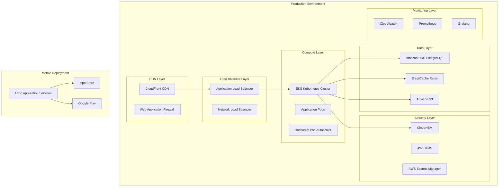

# GeoTag™ Deployment Guide

## Document Information
- **Version**: 2.1.0
- **Date**: January 2025
- **Classification**: CONFIDENTIAL
- **Audience**: DevOps Engineers, System Administrators, Platform Engineers

## Table of Contents
1. [Deployment Overview](#deployment-overview)
2. [Environment Specifications](#environment-specifications)
3. [Infrastructure Requirements](#infrastructure-requirements)
4. [Mobile Application Deployment](#mobile-application-deployment)
5. [Backend Services Deployment](#backend-services-deployment)
6. [Database Deployment](#database-deployment)
7. [Security Configuration](#security-configuration)
8. [Monitoring & Observability](#monitoring--observability)
9. [Disaster Recovery](#disaster-recovery)
10. [Troubleshooting Guide](#troubleshooting-guide)

## Deployment Overview

### Deployment Architecture



### Deployment Environments

#### Environment Tiers
```typescript
interface DeploymentEnvironments {
  development: {
    purpose: 'Active development and feature testing';
    infrastructure: 'Local Docker containers or lightweight cloud';
    dataVolume: 'Synthetic test data';
    uptime: '95% during business hours';
    security: 'Basic security for development workflow';
  };
  
  staging: {
    purpose: 'Integration testing and UAT';
    infrastructure: 'Production-like environment with reduced capacity';
    dataVolume: 'Anonymized production data subset';
    uptime: '99% during testing periods';
    security: 'Production-level security controls';
  };
  
  production: {
    purpose: 'Live customer-facing services';
    infrastructure: 'High-availability multi-region deployment';
    dataVolume: 'Full production data with compliance requirements';
    uptime: '99.9% SLA with 4-hour RTO';
    security: 'Maximum security with all controls enabled';
  };
}
```

## Environment Specifications

### Production Environment Specifications

#### Compute Resources
```yaml
# Kubernetes Cluster Specification
apiVersion: v1
kind: ConfigMap
metadata:
  name: cluster-config
data:
  cluster-specs: |
    nodeGroups:
      - name: system-nodes
        instanceType: c6i.xlarge
        minSize: 3
        maxSize: 6
        diskSize: 100GB
        diskType: gp3
        
      - name: application-nodes
        instanceType: c6i.2xlarge
        minSize: 6
        maxSize: 24
        diskSize: 200GB
        diskType: gp3
        
      - name: memory-nodes
        instanceType: r6i.xlarge
        minSize: 2
        maxSize: 8
        diskSize: 100GB
        diskType: gp3
        
    networking:
      vpcCidr: 10.0.0.0/16
      privateSubnets:
        - 10.0.1.0/24
        - 10.0.2.0/24
        - 10.0.3.0/24
      publicSubnets:
        - 10.0.101.0/24
        - 10.0.102.0/24
        - 10.0.103.0/24
```

#### Database Specifications
```typescript
interface DatabaseConfiguration {
  primary: {
    engine: 'PostgreSQL 15.4';
    instanceClass: 'db.r6g.xlarge';
    storage: '1TB SSD with 3000 IOPS';
    backupRetention: '30 days';
    multiAZ: true;
    encryption: 'AES-256 with customer-managed keys';
  };
  
  readReplicas: {
    count: 3;
    instanceClass: 'db.r6g.large';
    regions: ['us-west-2', 'eu-west-1', 'ap-southeast-1'];
  };
  
  cache: {
    engine: 'Redis 7.0';
    nodeType: 'cache.r6g.large';
    numNodes: 3;
    replicationGroups: 1;
    clustering: true;
  };
}
```

## Infrastructure Requirements

### Prerequisites Checklist

#### AWS Infrastructure Setup
```bash
#!/bin/bash
# Infrastructure Prerequisites Script

# 1. Create VPC and networking components
aws ec2 create-vpc --cidr-block 10.0.0.0/16 --tag-specifications 'ResourceType=vpc,Tags=[{Key=Name,Value=geotag-production-vpc}]'

# 2. Set up EKS cluster
eksctl create cluster --config-file=cluster-config.yaml

# 3. Configure RDS instance
aws rds create-db-instance \
  --db-instance-identifier geotag-production-db \
  --db-instance-class db.r6g.xlarge \
  --engine postgres \
  --allocated-storage 1000 \
  --storage-type gp3 \
  --storage-encrypted \
  --multi-az

# 4. Set up ElastiCache cluster
aws elasticache create-cache-cluster \
  --cache-cluster-id geotag-production-cache \
  --engine redis \
  --cache-node-type cache.r6g.large \
  --num-cache-nodes 3

# 5. Configure CloudHSM
aws cloudhsmv2 create-cluster \
  --hsm-type hsm1.medium \
  --subnet-ids subnet-12345 subnet-67890
```

#### Security Prerequisites
```yaml
# Security Configuration
apiVersion: v1
kind: Secret
metadata:
  name: geotag-secrets
  namespace: production
type: Opaque
data:
  database-password: <base64-encoded-password>
  jwt-secret: <base64-encoded-jwt-secret>
  encryption-key: <base64-encoded-encryption-key>
  
---
apiVersion: v1
kind: ConfigMap
metadata:
  name: security-config
  namespace: production
data:
  tls-config: |
    ssl_protocols: TLSv1.2 TLSv1.3
    ssl_ciphers: ECDHE+AESGCM:ECDHE+CHACHA20:DHE+AESGCM:DHE+CHACHA20:!aNULL:!MD5:!DSS
    ssl_prefer_server_ciphers: on
    hsts_max_age: 31536000
    
  security-headers: |
    X-Frame-Options: DENY
    X-Content-Type-Options: nosniff
    X-XSS-Protection: 1; mode=block
    Strict-Transport-Security: max-age=31536000; includeSubDomains
    Content-Security-Policy: default-src 'self'
```

## Mobile Application Deployment

### Expo Application Services (EAS) Build

#### Build Configuration
```json
{
  "expo": {
    "name": "GeoTag Mining Compliance",
    "slug": "geotag-mining",
    "version": "2.1.0",
    "orientation": "portrait",
    "icon": "./assets/icon.png",
    "userInterfaceStyle": "automatic",
    "splash": {
      "image": "./assets/splash.png",
      "resizeMode": "contain",
      "backgroundColor": "#1a1a2e"
    },
    "updates": {
      "fallbackToCacheTimeout": 0,
      "url": "https://u.expo.dev/12345678-1234-1234-1234-123456789012"
    },
    "assetBundlePatterns": [
      "**/*"
    ],
    "ios": {
      "supportsTablet": true,
      "bundleIdentifier": "com.geotag.mining",
      "buildNumber": "2024.1.15",
      "config": {
        "usesNonExemptEncryption": false
      },
      "associatedDomains": [
        "applinks:geotag.com",
        "applinks:api.geotag.com"
      ],
      "infoPlist": {
        "NSCameraUsageDescription": "This app uses camera to capture geotagged photos of mining operations for compliance documentation.",
        "NSLocationWhenInUseUsageDescription": "This app requires location access to verify mining operation coordinates for regulatory compliance.",
        "NSLocationAlwaysAndWhenInUseUsageDescription": "Location tracking ensures accurate documentation of mining activities.",
        "NSFaceIDUsageDescription": "Face ID provides secure authentication for accessing sensitive mining data.",
        "ITSAppUsesNonExemptEncryption": false
      }
    },
    "android": {
      "adaptiveIcon": {
        "foregroundImage": "./assets/adaptive-icon.png",
        "backgroundColor": "#1a1a2e"
      },
      "package": "com.geotag.mining",
      "versionCode": 20241115,
      "permissions": [
        "android.permission.CAMERA",
        "android.permission.ACCESS_FINE_LOCATION",
        "android.permission.ACCESS_COARSE_LOCATION",
        "android.permission.USE_FINGERPRINT",
        "android.permission.USE_BIOMETRIC",
        "android.permission.INTERNET",
        "android.permission.WRITE_EXTERNAL_STORAGE",
        "android.permission.READ_EXTERNAL_STORAGE"
      ],
      "intentFilters": [
        {
          "action": "VIEW",
          "data": [
            {
              "scheme": "https",
              "host": "geotag.com"
            }
          ],
          "category": [
            "BROWSABLE",
            "DEFAULT"
          ]
        }
      ]
    },
    "web": {
      "favicon": "./assets/favicon.png",
      "bundler": "metro"
    },
    "plugins": [
      "expo-router",
      "expo-secure-store",
      "expo-local-authentication",
      "expo-location",
      "expo-camera",
      "expo-barcode-scanner",
      [
        "expo-notifications",
        {
          "icon": "./assets/notification-icon.png",
          "color": "#ffffff",
          "defaultChannel": "default"
        }
      ]
    ],
    "extra": {
      "router": {
        "origin": false
      },
      "eas": {
        "projectId": "12345678-1234-1234-1234-123456789012"
      }
    },
    "owner": "geotag-enterprise"
  }
}
```

#### EAS Build Commands
```bash
# Build for iOS
eas build --platform ios --profile production

# Build for Android
eas build --platform android --profile production

# Build for both platforms
eas build --platform all --profile production

# Submit to app stores
eas submit --platform ios
eas submit --platform android

# Update over-the-air
eas update --branch production --message "Security patches and performance improvements"
```

### App Store Deployment

#### iOS App Store Configuration
```yaml
ios_deployment:
  app_store_connect:
    team_id: "ABCD123456"
    app_id: "1234567890"
    bundle_id: "com.geotag.mining"
    
  metadata:
    name: "GeoTag™ Mining Compliance"
    subtitle: "Enterprise Mining Operations"
    description: |
      Professional-grade mining compliance platform with cryptographic 
      provenance, GPS verification, and regulatory workflow automation.
      
    keywords: "mining, compliance, gold, blockchain, GPS, enterprise"
    category: "Business"
    
  review_information:
    contact_name: "Technical Review Team"
    contact_phone: "+1-555-0123"
    contact_email: "appstore@geotag.com"
    demo_account: "reviewer@geotag.com"
    demo_password: "[Secure Password for Review]"
    
  app_review_information:
    notes: |
      This is an enterprise application for mining compliance.
      Demo account provides access to test mining operations.
      Location and camera permissions are essential for core functionality.
```

#### Google Play Store Configuration
```yaml
android_deployment:
  google_play:
    service_account_json: "play-console-service-account.json"
    package_name: "com.geotag.mining"
    
  metadata:
    title: "GeoTag™ Mining Compliance"
    short_description: "Enterprise mining operations compliance platform"
    full_description: |
      Professional-grade mobile platform for mining compliance, featuring:
      - Cryptographic document authentication
      - High-precision GPS location verification  
      - Regulatory workflow automation
      - Multi-language support for global operations
      - Offline-capable for remote mining sites
      
    release_notes: |
      Version 2.1.0:
      - Enhanced security with Ed25519 cryptography
      - Global localization support (12+ languages)
      - Improved offline functionality
      - Performance optimizations
      - Security updates
      
  privacy_policy_url: "https://geotag.com/privacy"
  terms_of_service_url: "https://geotag.com/terms"
```

## Backend Services Deployment

### Kubernetes Deployment Manifests

#### Application Deployment
```yaml
apiVersion: apps/v1
kind: Deployment
metadata:
  name: geotag-api
  namespace: production
  labels:
    app: geotag-api
    version: v2.1.0
spec:
  replicas: 6
  strategy:
    type: RollingUpdate
    rollingUpdate:
      maxSurge: 2
      maxUnavailable: 1
  selector:
    matchLabels:
      app: geotag-api
  template:
    metadata:
      labels:
        app: geotag-api
        version: v2.1.0
    spec:
      serviceAccountName: geotag-api-sa
      securityContext:
        runAsNonRoot: true
        runAsUser: 10001
        fsGroup: 10001
      containers:
      - name: api
        image: geotag/api:2.1.0
        imagePullPolicy: Always
        ports:
        - containerPort: 8080
          protocol: TCP
        env:
        - name: NODE_ENV
          value: "production"
        - name: DATABASE_URL
          valueFrom:
            secretKeyRef:
              name: geotag-secrets
              key: database-url
        - name: JWT_SECRET
          valueFrom:
            secretKeyRef:
              name: geotag-secrets
              key: jwt-secret
        - name: ENCRYPTION_KEY
          valueFrom:
            secretKeyRef:
              name: geotag-secrets
              key: encryption-key
        resources:
          requests:
            memory: "512Mi"
            cpu: "250m"
          limits:
            memory: "1Gi"
            cpu: "500m"
        livenessProbe:
          httpGet:
            path: /health
            port: 8080
          initialDelaySeconds: 30
          periodSeconds: 10
          timeoutSeconds: 5
          failureThreshold: 3
        readinessProbe:
          httpGet:
            path: /ready
            port: 8080
          initialDelaySeconds: 5
          periodSeconds: 5
          timeoutSeconds: 3
          failureThreshold: 3
        volumeMounts:
        - name: app-config
          mountPath: /app/config
          readOnly: true
        - name: tls-certs
          mountPath: /app/certs
          readOnly: true
      volumes:
      - name: app-config
        configMap:
          name: geotag-config
      - name: tls-certs
        secret:
          secretName: tls-certificates
      imagePullSecrets:
      - name: registry-credentials
      
---
apiVersion: v1
kind: Service
metadata:
  name: geotag-api-service
  namespace: production
  labels:
    app: geotag-api
spec:
  type: ClusterIP
  ports:
  - port: 80
    targetPort: 8080
    protocol: TCP
  selector:
    app: geotag-api

---
apiVersion: autoscaling/v2
kind: HorizontalPodAutoscaler
metadata:
  name: geotag-api-hpa
  namespace: production
spec:
  scaleTargetRef:
    apiVersion: apps/v1
    kind: Deployment
    name: geotag-api
  minReplicas: 6
  maxReplicas: 24
  metrics:
  - type: Resource
    resource:
      name: cpu
      target:
        type: Utilization
        averageUtilization: 70
  - type: Resource
    resource:
      name: memory
      target:
        type: Utilization
        averageUtilization: 80
  behavior:
    scaleDown:
      stabilizationWindowSeconds: 300
      policies:
      - type: Percent
        value: 10
        periodSeconds: 60
    scaleUp:
      stabilizationWindowSeconds: 60
      policies:
      - type: Percent
        value: 50
        periodSeconds: 60
```

#### Worker Services Deployment
```yaml
apiVersion: apps/v1
kind: Deployment
metadata:
  name: geotag-workers
  namespace: production
spec:
  replicas: 4
  selector:
    matchLabels:
      app: geotag-workers
  template:
    metadata:
      labels:
        app: geotag-workers
    spec:
      containers:
      - name: certificate-processor
        image: geotag/certificate-processor:2.1.0
        env:
        - name: QUEUE_URL
          valueFrom:
            configMapKeyRef:
              name: geotag-config
              key: queue-url
        - name: HSM_CLUSTER_ID
          valueFrom:
            secretKeyRef:
              name: geotag-secrets
              key: hsm-cluster-id
        resources:
          requests:
            memory: "256Mi"
            cpu: "100m"
          limits:
            memory: "512Mi"
            cpu: "200m"
            
      - name: compliance-monitor
        image: geotag/compliance-monitor:2.1.0
        env:
        - name: MONITORING_INTERVAL
          value: "300"
        resources:
          requests:
            memory: "256Mi"
            cpu: "100m"
          limits:
            memory: "512Mi"
            cpu: "200m"
```

### Service Mesh Configuration

#### Istio Service Mesh
```yaml
apiVersion: networking.istio.io/v1beta1
kind: VirtualService
metadata:
  name: geotag-api-vs
  namespace: production
spec:
  hosts:
  - api.geotag.com
  gateways:
  - geotag-gateway
  http:
  - match:
    - uri:
        prefix: "/v2/"
    route:
    - destination:
        host: geotag-api-service
        port:
          number: 80
    fault:
      delay:
        percentage:
          value: 0.1
        fixedDelay: 5s
    timeout: 30s
    retries:
      attempts: 3
      perTryTimeout: 10s

---
apiVersion: networking.istio.io/v1beta1
kind: DestinationRule
metadata:
  name: geotag-api-dr
  namespace: production
spec:
  host: geotag-api-service
  trafficPolicy:
    connectionPool:
      tcp:
        maxConnections: 100
      http:
        http1MaxPendingRequests: 50
        maxRequestsPerConnection: 10
    loadBalancer:
      simple: LEAST_CONN
    outlierDetection:
      consecutive5xxErrors: 3
      interval: 30s
      baseEjectionTime: 30s
      maxEjectionPercent: 50
```

## Database Deployment

### PostgreSQL Configuration

#### Database Initialization Script
```sql
-- Database initialization for GeoTag™
-- Version: 2.1.0

-- Create databases
CREATE DATABASE geotag_production;
CREATE DATABASE geotag_analytics;

-- Create application user
CREATE USER geotag_app WITH PASSWORD 'secure_generated_password';

-- Connect to main database
\c geotag_production;

-- Enable required extensions
CREATE EXTENSION IF NOT EXISTS "uuid-ossp";
CREATE EXTENSION IF NOT EXISTS "postgis";
CREATE EXTENSION IF NOT EXISTS "pg_crypto";
CREATE EXTENSION IF NOT EXISTS "pg_trgm";

-- Create schemas
CREATE SCHEMA IF NOT EXISTS mining;
CREATE SCHEMA IF NOT EXISTS compliance;
CREATE SCHEMA IF NOT EXISTS certificates;
CREATE SCHEMA IF NOT EXISTS users;
CREATE SCHEMA IF NOT EXISTS audit;

-- Grant permissions
GRANT USAGE ON SCHEMA mining TO geotag_app;
GRANT USAGE ON SCHEMA compliance TO geotag_app;
GRANT USAGE ON SCHEMA certificates TO geotag_app;
GRANT USAGE ON SCHEMA users TO geotag_app;
GRANT SELECT ON SCHEMA audit TO geotag_app;

-- Create core tables
CREATE TABLE users.profiles (
    id UUID PRIMARY KEY DEFAULT uuid_generate_v4(),
    email VARCHAR(255) UNIQUE NOT NULL,
    role VARCHAR(50) NOT NULL,
    encrypted_data JSONB,
    created_at TIMESTAMP WITH TIME ZONE DEFAULT NOW(),
    updated_at TIMESTAMP WITH TIME ZONE DEFAULT NOW(),
    
    CONSTRAINT valid_role CHECK (role IN (
        'small-scale-miner',
        'government-inspector', 
        'mining-company',
        'gold-trader',
        'regulatory-authority',
        'environmental-officer'
    ))
);

CREATE TABLE mining.operations (
    id UUID PRIMARY KEY DEFAULT uuid_generate_v4(),
    user_id UUID NOT NULL REFERENCES users.profiles(id),
    operation_type VARCHAR(50) NOT NULL,
    location GEOGRAPHY(POINT, 4326) NOT NULL,
    location_accuracy FLOAT,
    status VARCHAR(50) NOT NULL DEFAULT 'draft',
    encrypted_data JSONB,
    digital_signature TEXT,
    created_at TIMESTAMP WITH TIME ZONE DEFAULT NOW(),
    updated_at TIMESTAMP WITH TIME ZONE DEFAULT NOW(),
    
    CONSTRAINT valid_operation_type CHECK (operation_type IN (
        'gold-extraction',
        'exploration', 
        'processing'
    )),
    CONSTRAINT valid_status CHECK (status IN (
        'draft', 'submitted', 'under-review', 
        'approved', 'rejected', 'completed'
    ))
);

CREATE TABLE certificates.issued_certificates (
    id UUID PRIMARY KEY DEFAULT uuid_generate_v4(),
    operation_id UUID NOT NULL REFERENCES mining.operations(id),
    certificate_type VARCHAR(50) NOT NULL,
    issuer_id UUID NOT NULL REFERENCES users.profiles(id),
    certificate_data JSONB NOT NULL,
    digital_signature TEXT NOT NULL,
    qr_code_data TEXT,
    valid_from TIMESTAMP WITH TIME ZONE DEFAULT NOW(),
    valid_until TIMESTAMP WITH TIME ZONE,
    status VARCHAR(20) DEFAULT 'active',
    created_at TIMESTAMP WITH TIME ZONE DEFAULT NOW(),
    
    CONSTRAINT valid_certificate_type CHECK (certificate_type IN (
        'origin-certificate',
        'assay-certificate',
        'export-permit',
        'compliance-certificate',
        'environmental-clearance'
    )),
    CONSTRAINT valid_status CHECK (status IN ('active', 'expired', 'revoked'))
);

-- Create indexes for performance
CREATE INDEX idx_operations_user_id ON mining.operations(user_id);
CREATE INDEX idx_operations_location ON mining.operations USING GIST(location);
CREATE INDEX idx_operations_status ON mining.operations(status);
CREATE INDEX idx_operations_created_at ON mining.operations(created_at DESC);

CREATE INDEX idx_certificates_operation_id ON certificates.issued_certificates(operation_id);
CREATE INDEX idx_certificates_type ON certificates.issued_certificates(certificate_type);
CREATE INDEX idx_certificates_status ON certificates.issued_certificates(status);
CREATE INDEX idx_certificates_valid_until ON certificates.issued_certificates(valid_until);

-- Create audit triggers
CREATE OR REPLACE FUNCTION audit.audit_trigger_function()
RETURNS TRIGGER AS $$
BEGIN
    INSERT INTO audit.audit_log (
        table_name,
        operation,
        old_values,
        new_values,
        user_id,
        timestamp
    ) VALUES (
        TG_TABLE_NAME,
        TG_OP,
        CASE WHEN TG_OP = 'DELETE' THEN row_to_json(OLD) ELSE NULL END,
        CASE WHEN TG_OP IN ('INSERT', 'UPDATE') THEN row_to_json(NEW) ELSE NULL END,
        COALESCE(NEW.user_id, OLD.user_id),
        NOW()
    );
    RETURN COALESCE(NEW, OLD);
END;
$$ LANGUAGE plpgsql SECURITY DEFINER;

-- Apply audit triggers to sensitive tables
CREATE TRIGGER audit_operations_trigger
    AFTER INSERT OR UPDATE OR DELETE ON mining.operations
    FOR EACH ROW EXECUTE FUNCTION audit.audit_trigger_function();

CREATE TRIGGER audit_certificates_trigger
    AFTER INSERT OR UPDATE OR DELETE ON certificates.issued_certificates
    FOR EACH ROW EXECUTE FUNCTION audit.audit_trigger_function();
```

#### Database Backup Configuration
```bash
#!/bin/bash
# Database backup script for production

# Configuration
DB_HOST="geotag-production-db.cluster-xyz.us-west-2.rds.amazonaws.com"
DB_NAME="geotag_production"
DB_USER="backup_user"
BACKUP_DIR="/var/backups/geotag"
S3_BUCKET="geotag-database-backups"
RETENTION_DAYS=30

# Create backup directory
mkdir -p "${BACKUP_DIR}"

# Generate backup filename with timestamp
TIMESTAMP=$(date +"%Y%m%d_%H%M%S")
BACKUP_FILE="${BACKUP_DIR}/geotag_backup_${TIMESTAMP}.sql.gz"

# Create encrypted database backup
pg_dump \
  --host="${DB_HOST}" \
  --username="${DB_USER}" \
  --dbname="${DB_NAME}" \
  --verbose \
  --format=custom \
  --compress=9 \
  --no-owner \
  --no-privileges | \
  gpg --cipher-algo AES256 --compress-algo 2 --symmetric | \
  gzip > "${BACKUP_FILE}"

# Upload to S3 with encryption
aws s3 cp "${BACKUP_FILE}" \
  "s3://${S3_BUCKET}/daily/$(basename ${BACKUP_FILE})" \
  --server-side-encryption aws:kms \
  --ssekms-key-id alias/geotag-backup-key

# Clean up local backups older than retention period
find "${BACKUP_DIR}" -name "geotag_backup_*.sql.gz" -mtime +${RETENTION_DAYS} -delete

# Verify backup integrity
if pg_restore --list "${BACKUP_FILE}" > /dev/null 2>&1; then
    echo "Backup completed successfully: ${BACKUP_FILE}"
else
    echo "ERROR: Backup verification failed" >&2
    exit 1
fi
```

## Security Configuration

### SSL/TLS Configuration

#### Certificate Management
```yaml
apiVersion: cert-manager.io/v1
kind: Certificate
metadata:
  name: geotag-tls-cert
  namespace: production
spec:
  secretName: geotag-tls-secret
  issuerRef:
    name: letsencrypt-prod
    kind: ClusterIssuer
  dnsNames:
  - geotag.com
  - api.geotag.com
  - admin.geotag.com
  - "*.geotag.com"
  
---
apiVersion: cert-manager.io/v1
kind: ClusterIssuer
metadata:
  name: letsencrypt-prod
spec:
  acme:
    server: https://acme-v02.api.letsencrypt.org/directory
    email: certificates@geotag.com
    privateKeySecretRef:
      name: letsencrypt-prod-private-key
    solvers:
    - dns01:
        route53:
          region: us-west-2
          accessKeyID: AKIA...
          secretAccessKeySecretRef:
            name: route53-credentials
            key: secret-access-key
```

### Network Security

#### Network Policies
```yaml
apiVersion: networking.k8s.io/v1
kind: NetworkPolicy
metadata:
  name: geotag-network-policy
  namespace: production
spec:
  podSelector:
    matchLabels:
      app: geotag-api
  policyTypes:
  - Ingress
  - Egress
  ingress:
  - from:
    - namespaceSelector:
        matchLabels:
          name: istio-system
    - podSelector:
        matchLabels:
          app: istio-proxy
    ports:
    - protocol: TCP
      port: 8080
  egress:
  - to:
    - namespaceSelector:
        matchLabels:
          name: kube-system
    ports:
    - protocol: TCP
      port: 53
    - protocol: UDP
      port: 53
  - to:
    - podSelector:
        matchLabels:
          app: postgresql
    ports:
    - protocol: TCP
      port: 5432
  - to:
    - podSelector:
        matchLabels:
          app: redis
    ports:
    - protocol: TCP
      port: 6379
```

## Monitoring & Observability

### Prometheus Configuration
```yaml
apiVersion: monitoring.coreos.com/v1
kind: ServiceMonitor
metadata:
  name: geotag-api-monitor
  namespace: production
spec:
  selector:
    matchLabels:
      app: geotag-api
  endpoints:
  - port: metrics
    path: /metrics
    interval: 30s
    scrapeTimeout: 10s

---
apiVersion: monitoring.coreos.com/v1
kind: PrometheusRule
metadata:
  name: geotag-alerts
  namespace: production
spec:
  groups:
  - name: geotag.rules
    rules:
    - alert: HighErrorRate
      expr: rate(http_requests_total{status=~"5.."}[5m]) > 0.1
      for: 2m
      labels:
        severity: warning
      annotations:
        summary: High error rate detected
        description: "Error rate is {{ $value }} for {{ $labels.instance }}"
        
    - alert: HighResponseTime
      expr: histogram_quantile(0.95, rate(http_request_duration_seconds_bucket[5m])) > 1.0
      for: 5m
      labels:
        severity: warning
      annotations:
        summary: High response time
        description: "95th percentile latency is {{ $value }}s"
        
    - alert: DatabaseConnectionsHigh
      expr: pg_stat_activity_count > 80
      for: 2m
      labels:
        severity: critical
      annotations:
        summary: High database connections
        description: "Database has {{ $value }} active connections"
```

### Logging Configuration
```yaml
apiVersion: logging.coreos.com/v1
kind: ClusterLogForwarder
metadata:
  name: geotag-log-forwarder
  namespace: openshift-logging
spec:
  outputs:
  - name: geotag-elasticsearch
    type: elasticsearch
    url: https://elasticsearch.geotag.com:9200
    secret:
      name: elasticsearch-credentials
    elasticsearch:
      index: geotag-logs-{+yyyy.MM.dd}
      
  pipelines:
  - name: application-logs
    inputRefs:
    - application
    filterRefs:
    - geotag-filter
    outputRefs:
    - geotag-elasticsearch
    
  - name: security-logs
    inputRefs:
    - audit
    outputRefs:
    - geotag-elasticsearch
```

## Disaster Recovery

### Backup Strategy
```bash
#!/bin/bash
# Comprehensive backup script

# 1. Database backup
pg_basebackup -h $DB_HOST -D /backup/db -U backup_user -v -P -W

# 2. Application data backup
kubectl create backup geotag-backup --include-namespaces=production

# 3. Configuration backup
kubectl get all,configmap,secret -o yaml --all-namespaces > /backup/k8s-config.yaml

# 4. Certificate backup
cp -r /etc/letsencrypt /backup/certificates/

# 5. Upload to multiple regions
aws s3 sync /backup s3://geotag-backup-primary/$(date +%Y-%m-%d)/
aws s3 sync /backup s3://geotag-backup-secondary/$(date +%Y-%m-%d)/ --region eu-west-1
```

### Recovery Procedures
```bash
#!/bin/bash
# Disaster recovery procedures

echo "Starting disaster recovery process..."

# 1. Restore database
pg_restore --host=$NEW_DB_HOST --username=$DB_USER --dbname=geotag_production /backup/latest_backup.sql

# 2. Restore Kubernetes resources  
kubectl apply -f /backup/k8s-config.yaml

# 3. Verify services
kubectl wait --for=condition=available --timeout=300s deployment/geotag-api

# 4. Run health checks
curl -f https://api.geotag.com/health || exit 1

echo "Disaster recovery completed successfully"
```

## Troubleshooting Guide

### Common Issues and Solutions

#### Application Startup Issues
```bash
# Check pod status
kubectl get pods -n production

# Check pod logs
kubectl logs -f deployment/geotag-api -n production

# Check events
kubectl get events -n production --sort-by='.lastTimestamp'

# Debug networking
kubectl exec -it pod/geotag-api-xxx -n production -- nslookup database-service
```

#### Database Connection Issues
```bash
# Check database connectivity
kubectl exec -it pod/geotag-api-xxx -n production -- \
  pg_isready -h database-service -p 5432

# Check database logs
aws rds describe-db-log-files --db-instance-identifier geotag-production-db
aws rds download-db-log-file-portion --db-instance-identifier geotag-production-db
```

#### Performance Issues
```bash
# Check resource utilization
kubectl top pods -n production
kubectl top nodes

# Check HPA status
kubectl get hpa -n production

# Analyze slow queries
kubectl exec -it postgresql-pod -- psql -c "
SELECT query, calls, total_time, mean_time 
FROM pg_stat_statements 
ORDER BY mean_time DESC LIMIT 10;"
```

---

**Document Control:**
- **Author**: DevOps Engineering Team
- **Technical Review**: Platform Architecture Team
- **Security Review**: Information Security Team
- **Next Review**: April 2025

**Classification: CONFIDENTIAL**  
*This deployment guide contains sensitive infrastructure information. Access is restricted to authorized personnel only.*