# GeoTag™ Compliance Implementation Roadmap

## Document Information
- **Version**: 2.1.0
- **Date**: January 2025
- **Classification**: CONFIDENTIAL - EXECUTIVE
- **Audience**: C-Level Executives, Board of Directors, Compliance Officers

## Executive Summary

This roadmap provides the critical path to achieve full ISO, security, and enterprise/government compliance requirements for GeoTag™. The implementation spans 12 months with three distinct phases, requiring an estimated investment of $2.5M-$3.5M in Year 1 to establish institutional-grade security and compliance capabilities.

## 🎯 **CRITICAL COMPLIANCE IMPLEMENTATION ROADMAP**

### **PHASE 1: FOUNDATIONAL SECURITY INFRASTRUCTURE (0-6 Months)**

#### **1. ISO 27001 Information Security Management System (ISMS)**

```typescript
interface ISO27001Implementation {
  // Immediate Actions Required
  step1_establishmentISMS: {
    actions: [
      'Appoint Chief Information Security Officer (CISO)',
      'Form Information Security Committee with C-level representation',
      'Define information security policy and objectives',
      'Establish security governance framework',
      'Create Information Security Management Manual'
    ];
    timeline: '30 days';
    deliverables: [
      'Board-approved Information Security Policy',
      'ISMS Charter and Governance Structure',
      'Security Roles and Responsibilities Matrix'
    ];
    budget: '$150K - Setup and consulting fees';
  };

  step2_riskAssessment: {
    actions: [
      'Conduct comprehensive information security risk assessment',
      'Identify and catalog all information assets',
      'Threat and vulnerability assessment',
      'Risk treatment plan development',
      'Establish risk appetite and tolerance levels'
    ];
    timeline: '60 days';
    deliverables: [
      'Information Asset Register',
      'Risk Assessment Report',
      'Risk Treatment Plan',
      'Statement of Applicability (SoA)'
    ];
    budget: '$200K - Risk assessment consulting and tools';
  };

  step3_controlImplementation: {
    actions: [
      'Implement 114 ISO 27001 Annex A controls',
      'Deploy security monitoring and incident response',
      'Establish access control and identity management',
      'Implement cryptographic controls',
      'Deploy data classification and handling procedures'
    ];
    timeline: '120 days';
    deliverables: [
      'Control Implementation Evidence',
      'Security Architecture Documentation',
      'Operational Security Procedures'
    ];
    budget: '$500K - Technology implementation and personnel';
  };

  certification: {
    timeline: '180 days total (6 months)';
    cost: '$75K - Certification body fees';
    maintenance: '$150K/year - Ongoing compliance and annual audits';
  };
}
```

#### **2. SOC 2 Type II Certification**

```typescript
interface SOC2Implementation {
  trustServiceCriteria: {
    security: {
      required: [
        'Multi-factor authentication system',
        'Network security controls (firewalls, IPS)',
        'Vulnerability management program',
        'Security incident response procedures',
        'Vendor risk management program'
      ];
      timeline: '90 days implementation';
      cost: '$300K - Security infrastructure';
    };

    availability: {
      required: [
        '99.9% uptime SLA with monitoring',
        'Disaster recovery and business continuity plans',
        'System capacity and performance monitoring',
        'Change management procedures',
        'Backup and recovery testing'
      ];
      timeline: '60 days implementation';
      cost: '$200K - Availability infrastructure';
    };

    processingIntegrity: {
      required: [
        'Data validation and error handling',
        'Transaction processing controls',
        'System interface controls',
        'Data transmission integrity checks',
        'Processing completeness verification'
      ];
      timeline: '45 days implementation';
      cost: '$150K - Processing controls';
    };

    confidentiality: {
      required: [
        'Data encryption at rest and in transit',
        'Access controls for confidential data',
        'Data loss prevention (DLP) systems',
        'Secure data disposal procedures',
        'Confidentiality agreements'
      ];
      timeline: '75 days implementation';
      cost: '$250K - Data protection systems';
    };

    privacy: {
      required: [
        'Privacy policy and consent management',
        'Data minimization and retention controls',
        'Individual rights management system',
        'Privacy impact assessments',
        'Cross-border data transfer controls'
      ];
      timeline: '90 days implementation';
      cost: '$200K - Privacy management platform';
    };
  };

  auditPreparation: {
    phase1_readinessAssessment: '30 days - Gap analysis and remediation planning ($50K)';
    phase2_implementation: '180 days - Control implementation and testing ($1.1M)';
    phase3_auditExecution: '45 days - Type II audit over 6-month period ($100K)';
    phase4_certification: '30 days - Report review and certification ($25K)';
  };

  totalInvestment: {
    implementation: '$1.275M';
    audit: '$175K';
    annual_maintenance: '$300K/year';
  };
}
```

### **PHASE 2: ADVANCED SECURITY CONTROLS (3-9 Months)**

#### **3. Comprehensive Security Monitoring & SIEM**

```yaml
# Security Information and Event Management Implementation
siem_implementation:
  technology_stack:
    primary_siem: 
      vendor: "Splunk Enterprise Security"
      cost: "$200K/year"
      features: "Advanced threat detection, ML-powered analytics"
    
    endpoint_detection:
      vendor: "CrowdStrike Falcon"
      cost: "$150K/year" 
      features: "EDR, threat hunting, incident response"
    
    vulnerability_management:
      vendor: "Tenable Nessus Professional"
      cost: "$75K/year"
      features: "Continuous vulnerability assessment"
    
    identity_management:
      vendor: "Okta Identity Cloud"
      cost: "$100K/year"
      features: "SSO, MFA, identity governance"

  log_sources:
    infrastructure:
      - AWS CloudTrail ($25K/year)
      - VPC Flow Logs (included)
      - Kubernetes Audit Logs (included)
      - Load Balancer Access Logs (included)
    
    applications:
      - Application Security Logs (custom implementation)
      - API Gateway Logs (included)
      - Database Audit Logs (included)
      - Mobile App Security Events (custom implementation)
    
    security_tools:
      - Firewall Logs (included)
      - IDS/IPS Alerts (included)
      - Vulnerability Scan Results (included)
      - Anti-malware Events (included)

  monitoring_use_cases:
    threat_detection:
      - Failed authentication attempts (>5 per minute)
      - Privilege escalation activities
      - Unusual data access patterns
      - Suspicious network traffic
      - Malware detection events
      - Data exfiltration attempts
      - Compliance violation alerts
    
    automated_response:
      - Account lockouts for suspicious activity
      - Network isolation for compromised endpoints
      - Incident ticket creation and assignment
      - Executive notification for critical events

  staffing_requirements:
    soc_team:
      - SOC Manager (1x) - $180K/year
      - Senior SOC Analysts (2x) - $140K/year each
      - SOC Analysts (4x) - $90K/year each
      - Incident Response Specialist (1x) - $160K/year
    
    total_personnel_cost: "$1.04M/year"

  implementation_timeline:
    phase_1: "30 days - Tool procurement and setup"
    phase_2: "60 days - Log source integration"
    phase_3: "90 days - Use case development and tuning"
    phase_4: "30 days - SOC team hiring and training"
    
  total_first_year_cost: "$1.59M"
```

#### **4. Penetration Testing & Security Assessments**

```typescript
interface SecurityTesting {
  penetrationTesting: {
    external_testing: {
      frequency: 'Quarterly';
      vendor: 'Rapid7 (Primary)';
      scope: [
        'Web applications and APIs',
        'Mobile applications (iOS/Android)', 
        'Network infrastructure perimeter',
        'Cloud infrastructure (AWS)'
      ];
      cost: '$150K/year';
    };

    internal_testing: {
      frequency: 'Monthly';
      vendor: 'Internal Red Team';
      scope: [
        'Internal network segmentation',
        'Privilege escalation paths',
        'Lateral movement prevention',
        'Data access controls'
      ];
      cost: '$200K/year (2x internal specialists)';
    };

    specialized_testing: {
      cryptography_review: {
        vendor: 'Trail of Bits';
        frequency: 'Bi-annual';
        scope: 'Ed25519 implementation, key management, crypto protocols';
        cost: '$100K/year';
      };
      
      mobile_security: {
        vendor: 'NowSecure';
        frequency: 'Per release + quarterly';
        scope: 'iOS/Android app security, API security';
        cost: '$75K/year';
      };
    };
  };

  vulnerabilityManagement: {
    scanning_infrastructure: {
      external_scans: {
        frequency: 'Weekly';
        tool: 'Tenable.io';
        cost: 'Included in SIEM package';
      };
      
      internal_scans: {
        frequency: 'Daily';
        tool: 'Rapid7 InsightVM';
        cost: '$50K/year';
      };
      
      application_scans: {
        frequency: 'CI/CD integrated';
        tools: ['Checkmarx SAST', 'Veracode DAST'];
        cost: '$100K/year';
      };
    };
    
    remediation_sla: {
      critical: '24 hours - Immediate patching required';
      high: '72 hours - Priority patching';
      medium: '30 days - Standard patching cycle';
      low: '90 days - Next maintenance window';
    };

    kpis: [
      'Mean Time to Detect (MTTD): <1 hour',
      'Mean Time to Respond (MTTR): <4 hours',
      'Critical vulnerability remediation: 100% within SLA',
      'Vulnerability backlog: <100 open findings'
    ];
  };

  redTeamExercises: {
    comprehensive_exercises: {
      frequency: 'Bi-annual';
      vendor: 'External red team specialists';
      scenarios: [
        'Advanced persistent threat (APT) simulation',
        'Insider threat scenarios',
        'Supply chain attack simulation',
        'Social engineering campaigns',
        'Physical security assessment'
      ];
      cost: '$200K/year';
    };

    purple_team_activities: {
      frequency: 'Monthly';
      participants: 'Internal red team + SOC team';
      objectives: [
        'Detection capability validation',
        'Incident response procedure testing',
        'Security control effectiveness testing',
        'Team coordination improvement'
      ];
      cost: '$50K/year (internal resource time)';
    };
  };

  total_security_testing_budget: '$925K/year';
}
```

### **PHASE 3: REGULATORY COMPLIANCE & GOVERNANCE (6-12 Months)**

#### **5. Regulatory Compliance Framework**

```typescript
interface RegulatoryCompliance {
  financialServices: {
    aml_kyc_implementation: {
      technology_stack: [
        {
          vendor: 'Chainalysis KYT (Know Your Transaction)';
          purpose: 'Real-time transaction monitoring and blockchain analysis';
          cost: '$300K/year';
          implementation: '60 days';
        },
        {
          vendor: 'Thomson Reuters World-Check';
          purpose: 'PEP and sanctions screening';
          cost: '$150K/year';
          implementation: '30 days';
        },
        {
          vendor: 'SAS Anti-Money Laundering';
          purpose: 'Advanced analytics and case management';
          cost: '$200K/year';
          implementation: '90 days';
        }
      ];

      processes: {
        customer_onboarding: {
          tier1: 'Basic KYC - Automated verification ($0-$1K transactions)';
          tier2: 'Enhanced KYC - Manual review ($1K-$10K transactions)';
          tier3: 'Premium KYC - Extensive due diligence (>$10K transactions)';
        };

        ongoing_monitoring: {
          transaction_monitoring: 'Real-time AML transaction monitoring';
          periodic_reviews: 'Annual customer risk reassessment';
          suspicious_activity: 'Automated SAR generation and filing';
        };
      };

      staffing: {
        compliance_officers: '3x AML Officers @ $120K/year = $360K/year';
        analysts: '2x AML Analysts @ $80K/year = $160K/year';
        management: '1x Chief Compliance Officer @ $200K/year';
        total_personnel: '$720K/year';
      };

      certification_requirements: {
        cams_certification: 'Certified Anti-Money Laundering Specialist - $2K/person';
        acams_training: 'Association of Certified Anti-Money Laundering Specialists - $5K/year';
        regulatory_training: 'Ongoing regulatory update training - $10K/year';
      };
    };

    pci_dss_compliance: {
      level: 'Level 1 Merchant (>6M transactions/year)';
      
      requirements_implementation: {
        network_security: {
          firewalls: 'Next-generation firewalls with deep packet inspection - $75K';
          network_segmentation: 'Micro-segmentation with zero-trust architecture - $150K';
          wireless_security: 'Enterprise wireless security controls - $25K';
        };

        data_protection: {
          encryption: 'AES-256 encryption for cardholder data - $50K';
          key_management: 'Hardware Security Module (HSM) - $100K/year';
          data_retention: 'Automated data retention and disposal - $25K';
        };

        access_control: {
          user_authentication: 'Multi-factor authentication for all systems - Included';
          authorization: 'Role-based access control with least privilege - $30K';
          monitoring: 'User access monitoring and logging - Included in SIEM';
        };

        testing_requirements: {
          penetration_testing: 'Annual penetration testing - $50K/year';
          vulnerability_scanning: 'Quarterly vulnerability scans - $25K/year';
          code_review: 'Secure code review for payment processing - $75K/year';
        };
      };

      assessment_and_certification: {
        qsa_engagement: 'Qualified Security Assessor - $100K';
        remediation: 'Gap remediation and implementation - $200K';
        annual_assessment: 'Annual PCI DSS assessment - $75K/year';
      };

      total_pci_investment: {
        initial: '$955K';
        annual: '$250K/year';
      };
    };
  };

  dataProtection: {
    gdpr_compliance: {
      privacy_by_design: {
        architecture_review: 'Privacy-focused architecture assessment - $50K';
        dpia_framework: 'Data Protection Impact Assessment framework - $25K';
        privacy_controls: 'Technical privacy controls implementation - $100K';
      };

      data_subject_rights: {
        rights_management_platform: {
          vendor: 'OneTrust Privacy Management';
          cost: '$100K/year';
          features: [
            'Data subject request automation',
            'Consent management',
            'Data mapping and discovery',
            'Breach notification automation'
          ];
        };

        implementation_requirements: {
          data_discovery: 'Automated data discovery and classification - $50K';
          consent_management: 'Granular consent management system - $75K';
          deletion_automation: 'Right to erasure automation - $50K';
          portability: 'Data portability tools - $25K';
        };
      };

      cross_border_transfers: {
        standard_contractual_clauses: 'SCC implementation and management - $25K';
        adequacy_decisions: 'Adequacy decision compliance framework - $15K';
        binding_corporate_rules: 'BCR development (if needed) - $100K';
      };

      staffing: {
        data_protection_officer: '1x DPO @ $150K/year (external consultant)';
        privacy_analysts: '2x Privacy Analysts @ $90K/year = $180K/year';
        legal_counsel: '1x Privacy Lawyer (part-time) @ $75K/year';
        total_personnel: '$405K/year';
      };

      total_gdpr_investment: {
        initial: '$615K';
        annual: '$505K/year';
      };
    };

    ccpa_compliance: {
      consumer_rights_portal: {
        development: 'Custom consumer rights portal - $100K';
        integration: 'CRM and data system integration - $50K';
        automation: 'Automated request processing - $75K';
      };

      do_not_sell_mechanism: {
        implementation: 'Global Privacy Control (GPC) support - $25K';
        tracking: 'Opt-out preference tracking - $25K';
        vendor_management: 'Third-party data sharing controls - $50K';
      };

      total_ccpa_investment: {
        initial: '$325K';
        annual: '$50K/year';
      };
    };
  };

  mining_industry_compliance: {
    oecd_due_diligence: {
      supply_chain_mapping: {
        blockchain_implementation: 'Supply chain tracking on blockchain - $200K';
        vendor_assessment: 'Supplier due diligence platform - $100K';
        risk_assessment: 'AI-powered risk assessment tools - $150K';
      };

      grievance_mechanism: {
        platform_development: 'Multi-language grievance portal - $75K';
        case_management: 'Grievance case management system - $50K';
        stakeholder_engagement: 'Community engagement tools - $25K';
      };
    };

    lbma_responsible_gold: {
      chain_of_custody: {
        digital_certificates: 'Cryptographic certificate system - Included in core platform';
        audit_trail: 'Immutable audit trail system - Included in core platform';
        verification_portal: 'Public verification portal - $50K';
      };
    };

    eiti_transparency: {
      reporting_platform: {
        data_aggregation: 'Multi-source data aggregation - $100K';
        public_disclosure: 'Transparency reporting portal - $75K';
        stakeholder_access: 'Multi-stakeholder access controls - $25K';
      };
    };

    total_mining_compliance: {
      initial: '$850K';
      annual: '$100K/year';
    };
  };

  total_regulatory_compliance_investment: {
    phase_1: '$3.195M (initial implementation)';
    annual_ongoing: '$1.41M/year';
  };
}
```

#### **6. Enterprise Governance Structure**

```typescript
interface GovernanceStructure {
  boardLevel: {
    securityCommittee: {
      composition: [
        'Independent Director (Chair) - $50K/year retainer',
        'CEO - No additional compensation',
        'CTO - No additional compensation', 
        'CISO - $250K/year base salary',
        'External Security Expert - $75K/year retainer'
      ];
      
      meeting_frequency: 'Monthly board meetings';
      
      responsibilities: [
        'Security strategy and policy approval',
        'Risk appetite and tolerance setting',
        'Security investment decisions ($100K+ approval authority)',
        'Incident response oversight',
        'Regulatory compliance oversight',
        'Annual security budget approval',
        'CISO performance evaluation'
      ];

      governance_framework: {
        charter: 'Board-approved Security Committee Charter - $25K legal fees';
        policies: 'Executive security policies and procedures - $50K';
        reporting: 'Monthly security dashboard and metrics - Included';
        training: 'Board cybersecurity training - $15K/year';
      };

      annual_cost: '$415K/year';
    };

    auditCommittee: {
      security_oversight: 'Integration of security into audit committee oversight';
      external_audits: 'Annual security and compliance audits - $200K/year';
      internal_audit: 'Internal security audit function - $150K/year';
    };
  };

  executiveLevel: {
    riskCommittee: {
      composition: [
        'Chief Risk Officer (CRO) - $200K/year',
        'Chief Information Security Officer (CISO) - $250K/year',
        'Chief Compliance Officer (CCO) - $200K/year',
        'Chief Technology Officer (CTO) - Existing role',
        'Chief Operating Officer (COO) - Existing role'
      ];
      
      meeting_frequency: 'Weekly operational meetings';
      
      responsibilities: [
        'Operational risk management',
        'Security incident response coordination',
        'Compliance monitoring and reporting',
        'Vendor risk assessment and management',
        'Business continuity planning and testing',
        'Risk metrics and KPI monitoring',
        'Escalation to board-level committees'
      ];

      risk_management_platform: {
        vendor: 'ServiceNow Governance, Risk, and Compliance (GRC)';
        cost: '$150K/year';
        features: [
          'Integrated risk management',
          'Compliance monitoring',
          'Vendor risk management',
          'Policy and procedure management',
          'Audit management',
          'Incident management integration'
        ];
      };

      annual_cost: '$800K/year (personnel + platform)';
    };

    crisis_management: {
      crisis_team: 'Executive crisis management team';
      communication_plan: 'Crisis communication procedures';
      business_continuity: 'Business continuity and disaster recovery';
      cyber_insurance: '$50M cyber liability insurance - $500K/year';
    };
  };

  operationalLevel: {
    securitySteeringCommittee: {
      composition: [
        'CISO (Chair) - Existing role',
        'DevOps Lead - $140K/year', 
        'QA Lead - $120K/year',
        'Product Manager - Existing role',
        'Security Architect - $160K/year',
        'Compliance Manager - $130K/year'
      ];
      
      meeting_frequency: 'Bi-weekly operational meetings';
      
      responsibilities: [
        'Security architecture decisions',
        'Security tool evaluation and procurement',
        'Incident response execution',
        'Security training coordination',
        'Metrics and reporting to executive level',
        'Security project prioritization',
        'Vendor security assessments'
      ];

      annual_cost: '$550K/year (incremental roles)';
    };

    changeAdvisoryBoard: {
      security_integration: 'Security representative on all change reviews';
      security_gates: 'Security approval gates for production changes';
      emergency_procedures: 'Security considerations for emergency changes';
    };
  };

  governance_technology: {
    grc_platform: {
      primary_platform: 'ServiceNow GRC Suite - $150K/year';
      integrations: [
        'SIEM integration for security events',
        'ITSM integration for incident management',
        'HR integration for access management',
        'Finance integration for vendor management'
      ];
    };

    document_management: {
      platform: 'Microsoft 365 with compliance features - $50K/year';
      security: 'Document classification and protection - Included';
      retention: 'Automated retention and disposal - Included';
    };

    board_portal: {
      secure_portal: 'Diligent Boards secure board portal - $75K/year';
      features: [
        'Secure document sharing',
        'Meeting management',
        'Voting and approvals',
        'Audit trail and compliance'
      ];
    };
  };

  total_governance_investment: {
    setup_costs: '$200K (charter, policies, initial training)';
    annual_operational: '$2.54M/year';
    technology: '$275K/year';
    total_annual: '$2.815M/year';
  };
}
```

## **CRITICAL SUCCESS FACTORS**

### **1. Resource Requirements**

```yaml
personnel_requirements:
  executive_leadership:
    - Chief Information Security Officer (CISO): $250K/year
    - Chief Risk Officer (CRO): $200K/year  
    - Chief Compliance Officer (CCO): $200K/year
    - Data Protection Officer (DPO): $150K/year (consultant)

  security_team:
    - Security Architect (2x): $160K/year each
    - Security Engineers (4x): $130K/year each
    - SOC Manager (1x): $180K/year
    - SOC Analysts (6x for 24/7): $90K/year each
    - Incident Response Specialists (2x): $160K/year each

  compliance_team:
    - AML Officers (3x): $120K/year each
    - Privacy Analysts (2x): $90K/year each
    - Compliance Analysts (2x): $80K/year each
    - Internal Auditors (2x): $100K/year each

  operational_support:
    - DevOps Security Specialist (2x): $140K/year each
    - QA Security Specialist (1x): $120K/year
    - Documentation Specialist (1x): $80K/year

estimated_budget:
  year_1_total: "$8.5M - $12M"
  breakdown:
    personnel: "65% ($5.5M - $7.8M)"
    technology: "20% ($1.7M - $2.4M)"
    consulting: "10% ($850K - $1.2M)"
    certification: "3% ($255K - $360K)"
    insurance: "2% ($170K - $240K)"

ongoing_annual:
  year_2_plus: "$6M - $8.5M/year"
  roi_justification:
    - "Enterprise customer acquisition ($50M+ ARR potential)"
    - "Government contract eligibility ($100M+ market opportunity)"
    - "Risk mitigation (avoid $10M+ breach costs)"
    - "Regulatory compliance (avoid $5M+ penalties)"
    - "Insurance savings ($200K+ annual premium reduction)"
```

### **2. Technology Infrastructure Investment**

```yaml
required_technologies:
  tier_1_security_tools:
    - SIEM: Splunk Enterprise Security - $200K/year
    - EDR: CrowdStrike Falcon Enterprise - $150K/year
    - Identity Management: Okta Identity Cloud - $100K/year
    - Vulnerability Management: Tenable.io - $75K/year
    - Data Loss Prevention: Microsoft Purview - $125K/year

  tier_1_compliance_tools:
    - AML/KYC: Chainalysis KYT + Thomson Reuters - $450K/year
    - GRC Platform: ServiceNow GRC - $150K/year
    - Privacy Management: OneTrust - $100K/year
    - Risk Management: Integrated with ServiceNow - Included

  tier_1_infrastructure:
    - Hardware Security Module: AWS CloudHSM - $50K/year
    - Web Application Firewall: Cloudflare Enterprise - $75K/year
    - Backup & Recovery: Veeam Enterprise - $50K/year
    - Monitoring & Observability: Datadog Enterprise - $100K/year
    - Container Security: Twistlock/Prisma Cloud - $75K/year

  specialized_tools:
    - Cryptography Assessment: Trail of Bits (consulting) - $100K/year
    - Mobile Security: NowSecure - $75K/year
    - Blockchain Analysis: Chainalysis Reactor - $50K/year
    - Threat Intelligence: Recorded Future - $100K/year

  development_security:
    - SAST: Checkmarx - $50K/year
    - DAST: Veracode - $50K/year
    - Container Scanning: Twistlock - Included above
    - Secrets Management: HashiCorp Vault - $25K/year

total_technology_investment:
  initial_setup: "$500K (hardware, setup, integration)"
  annual_licensing: "$2M/year"
  annual_maintenance: "$200K/year"
```

### **3. Implementation Timeline & Milestones**

```mermaid
gantt
    title GeoTag™ Compliance Implementation Timeline
    dateFormat  YYYY-MM-DD
    section Phase 1: Foundation
    Hire CISO                 :milestone, ciso, 2025-01-15, 0d
    ISMS Setup               :isms, 2025-01-15, 30d
    Risk Assessment          :risk, 2025-02-01, 60d
    SOC 2 Readiness         :soc2-ready, 2025-02-15, 30d
    Security Tools Deployment :tools, 2025-03-01, 90d
    
    section Phase 2: Advanced Security  
    SIEM Implementation      :siem, 2025-03-15, 60d
    SOC Team Hiring         :soc-team, 2025-04-01, 45d
    Penetration Testing      :pentest, 2025-04-15, 30d
    Red Team Exercises       :redteam, 2025-05-01, 45d
    
    section Phase 3: Compliance
    AML/KYC Implementation   :aml, 2025-04-01, 120d
    GDPR Compliance         :gdpr, 2025-05-01, 90d
    PCI DSS Assessment      :pci, 2025-06-01, 180d
    Mining Compliance       :mining, 2025-07-01, 90d
    
    section Certifications
    ISO 27001 Pre-audit     :iso-pre, 2025-06-01, 30d
    ISO 27001 Certification :milestone, iso-cert, 2025-08-01, 0d
    SOC 2 Type II Audit     :soc2-audit, 2025-08-01, 90d
    SOC 2 Certification     :milestone, soc2-cert, 2025-11-01, 0d
```



## **IMMEDIATE NEXT ACTIONS (NEXT 30 DAYS)**

### **Week 1-2: Executive Actions**
1. **Board Resolution**: Formal board approval for compliance initiative and budget
2. **CISO Recruitment**: Engage executive search firm for CISO recruitment
3. **Legal Engagement**: Retain specialized cybersecurity and compliance legal counsel
4. **Insurance Review**: Procure $50M+ cyber liability insurance policy
5. **Consulting Engagement**: Retain ISO 27001 and SOC 2 consulting firms

### **Week 3-4: Operational Setup**
6. **Security Committee**: Establish board-level security committee with charter
7. **Risk Assessment**: Begin comprehensive information security risk assessment
8. **Tool Procurement**: Initiate procurement process for core security tools
9. **Baseline Assessment**: Conduct current-state security and compliance assessment
10. **Project Management**: Establish compliance PMO with dedicated resources

### **30-Day Milestone Targets**
- ✅ CISO hired and onboarded
- ✅ Board security committee established and operational
- ✅ ISO 27001 consulting engagement initiated
- ✅ Core security tools procurement in progress
- ✅ Comprehensive project plan and budget finalized
- ✅ Risk assessment 50% complete
- ✅ Insurance coverage in place
- ✅ Legal framework established

## **SUCCESS METRICS & KPIs**

### **Security Metrics**
- **Mean Time to Detect (MTTD)**: < 1 hour
- **Mean Time to Respond (MTTR)**: < 4 hours  
- **Critical Vulnerability Remediation**: 100% within 24 hours
- **Security Awareness Training**: 100% completion quarterly
- **Penetration Test Findings**: <5 critical findings per assessment

### **Compliance Metrics**
- **Audit Findings**: Zero critical findings in external audits
- **Regulatory Violations**: Zero violations or penalties
- **Policy Compliance**: >95% compliance across all policies
- **Training Completion**: 100% compliance training completion
- **Incident Response**: <30 minutes notification for critical incidents

### **Business Impact Metrics**
- **Enterprise Customer Acquisition**: 50%+ increase in enterprise deals
- **Government Contract Eligibility**: Qualify for federal contracts
- **Insurance Premium Reduction**: 25% reduction in cyber insurance costs
- **Regulatory Approval Time**: 50% faster regulatory approvals
- **Brand Trust Score**: Achieve top-tier security ratings

## **RISK MITIGATION**

### **Implementation Risks**
- **Resource Constraints**: Mitigate through phased approach and external consulting
- **Timeline Delays**: Build 20% buffer into all timelines
- **Technology Integration**: Proof-of-concept testing before full deployment
- **Talent Acquisition**: Engage multiple recruitment channels and consultants
- **Budget Overruns**: Monthly budget reviews with executive steering committee

### **Operational Risks**
- **Business Disruption**: Implement changes during low-traffic periods
- **Performance Impact**: Comprehensive performance testing before deployment
- **User Acceptance**: Change management and training programs
- **Vendor Dependency**: Multi-vendor strategy and contract protections
- **Regulatory Changes**: Continuous monitoring and adaptive compliance framework

## **CONCLUSION**

This comprehensive compliance implementation roadmap positions GeoTag™ for enterprise and government market success while establishing best-in-class security and compliance capabilities. The $8.5M-$12M Year 1 investment delivers:

- **ISO 27001 and SOC 2 Type II certifications**
- **Comprehensive regulatory compliance across all target markets**
- **Enterprise-grade security infrastructure and operations**
- **Formal governance and risk management framework**
- **Market leadership in mining industry compliance**

The ROI is compelling with $150M+ in new market opportunities, significant risk mitigation, and competitive differentiation that justifies the investment and establishes GeoTag™ as the trusted platform for institutional mining operations globally.

---

**Document Control:**
- **Classification**: CONFIDENTIAL - EXECUTIVE
- **Author**: Chief Strategy Officer
- **Approved By**: Chief Executive Officer
- **Board Approval**: Required for budget authorization
- **Next Review**: Monthly progress reviews
- **Distribution**: Board of Directors, C-Suite Executives, Compliance Leadership

**EXECUTIVE NOTICE**: This roadmap requires immediate board approval and budget authorization to maintain competitive positioning and regulatory compliance in target markets.