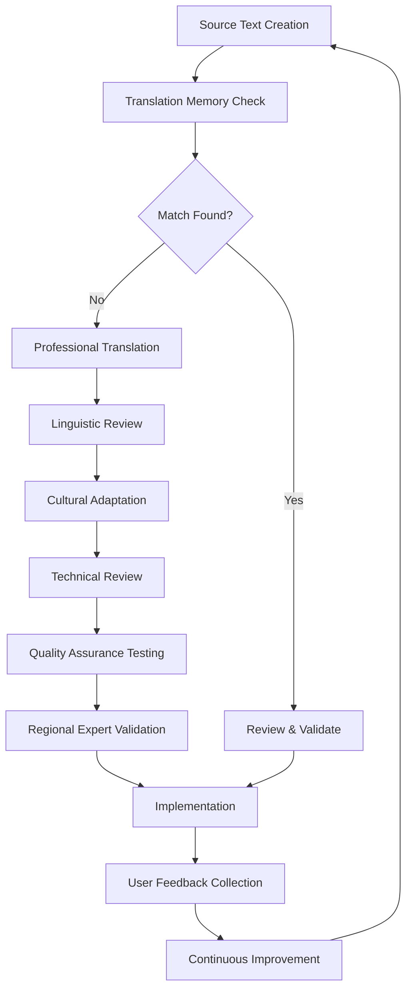

# GeoTag™ Internationalization & Localization Specifications

## Document Information
- **Version**: 2.1.0
- **Date**: January 2025
- **Classification**: TECHNICAL
- **Audience**: Developers, Localization Teams, Product Managers

## Table of Contents
1. [Overview](#overview)
2. [Supported Languages & Regions](#supported-languages--regions)
3. [Technical Implementation](#technical-implementation)
4. [Content Localization](#content-localization)
5. [Regional Compliance Adaptation](#regional-compliance-adaptation)
6. [Cultural Considerations](#cultural-considerations)
7. [Translation Management](#translation-management)
8. [Testing & Quality Assurance](#testing--quality-assurance)
9. [Deployment & Rollout](#deployment--rollout)

## Overview

GeoTag™ implements a comprehensive internationalization (i18n) and localization (l10n) framework designed to provide world-class user experiences across diverse global markets. The system supports multiple languages, regional compliance frameworks, and cultural adaptations to ensure accessibility and usability for mining professionals worldwide.

### Internationalization Philosophy
```typescript
interface I18nStrategy {
  globalFirst: 'Design for global markets from the ground up';
  culturalSensitivity: 'Respect local customs and business practices';
  complianceAdaptation: 'Adapt to regional mining regulations and standards';
  accessibilityFirst: 'Ensure universal accessibility across all languages';
  performanceOptimized: 'Maintain performance with dynamic language loading';
}
```

### Key Capabilities
- **12+ Language Support**: Full translation coverage for major mining regions
- **RTL Language Support**: Complete right-to-left language implementation
- **Regional Adaptation**: Mining compliance frameworks adapted by region
- **Dynamic Content**: Real-time language switching without app restart
- **Offline Capability**: Cached translations for offline operation
- **Cultural Localization**: Culturally appropriate UI/UX patterns

## Supported Languages & Regions

### Primary Languages
```typescript
export const SUPPORTED_LANGUAGES = {
  'en': { 
    name: 'English', 
    nativeName: 'English', 
    rtl: false, 
    flag: '🇺🇸',
    regions: ['global'],
    completeness: '100%'
  },
  'fr': { 
    name: 'French', 
    nativeName: 'Français', 
    rtl: false, 
    flag: '🇫🇷',
    regions: ['west-africa', 'central-africa'],
    completeness: '100%'
  },
  'es': { 
    name: 'Spanish', 
    nativeName: 'Español', 
    rtl: false, 
    flag: '🇪🇸',
    regions: ['latin-america'],
    completeness: '100%'
  },
  'pt': { 
    name: 'Portuguese', 
    nativeName: 'Português', 
    rtl: false, 
    flag: '🇵🇹',
    regions: ['latin-america', 'southern-africa'],
    completeness: '95%'
  },
  'ar': { 
    name: 'Arabic', 
    nativeName: 'العربية', 
    rtl: true, 
    flag: '🇸🇦',
    regions: ['middle-east', 'north-africa'],
    completeness: '90%'
  },
  'zh': { 
    name: 'Chinese Simplified', 
    nativeName: '中文', 
    rtl: false, 
    flag: '🇨🇳',
    regions: ['asia-pacific'],
    completeness: '85%'
  },
  'ru': { 
    name: 'Russian', 
    nativeName: 'Русский', 
    rtl: false, 
    flag: '🇷🇺',
    regions: ['central-asia', 'eastern-europe'],
    completeness: '80%'
  },
  'sw': { 
    name: 'Swahili', 
    nativeName: 'Kiswahili', 
    rtl: false, 
    flag: '🇹🇿',
    regions: ['east-africa'],
    completeness: '95%'
  },
  'am': { 
    name: 'Amharic', 
    nativeName: 'አማርኛ', 
    rtl: false, 
    flag: '🇪🇹',
    regions: ['east-africa'],
    completeness: '85%'
  },
  'yo': { 
    name: 'Yoruba', 
    nativeName: 'Yorùbá', 
    rtl: false, 
    flag: '🇳🇬',
    regions: ['west-africa'],
    completeness: '80%'
  },
  'ig': { 
    name: 'Igbo', 
    nativeName: 'Igbo', 
    rtl: false, 
    flag: '🇳🇬',
    regions: ['west-africa'],
    completeness: '75%'
  },
  'ha': { 
    name: 'Hausa', 
    nativeName: 'Hausa', 
    rtl: false, 
    flag: '🇳🇬',
    regions: ['west-africa'],
    completeness: '75%'
  },
  'tw': { 
    name: 'Twi', 
    nativeName: 'Twi', 
    rtl: false, 
    flag: '🇬🇭',
    regions: ['west-africa'],
    completeness: '100%'
  }
} as const;
```

### Mining Regions & Language Mapping
```typescript
export const MINING_REGIONS = {
  'west-africa': {
    name: 'West Africa',
    countries: ['GH', 'NG', 'ML', 'BF', 'CI', 'SN', 'GN', 'SL', 'LR'],
    primaryLanguages: ['en', 'fr', 'tw', 'yo', 'ig', 'ha'],
    culturalNotes: {
      businessEtiquette: 'Respectful greetings and community consultation important',
      timeFormat: '12-hour format preferred in English-speaking countries',
      numberFormat: 'Comma separator for thousands, period for decimal',
      currencyFormat: 'Local currency symbols (₵, ₦, etc.)'
    }
  },
  
  'east-africa': {
    name: 'East Africa', 
    countries: ['ET', 'KE', 'TZ', 'UG', 'RW', 'BI'],
    primaryLanguages: ['en', 'sw', 'am'],
    culturalNotes: {
      businessEtiquette: 'Community involvement and environmental stewardship valued',
      timeFormat: '24-hour format common',
      dateFormat: 'DD/MM/YYYY format preferred',
      measurementSystem: 'Metric system standard'
    }
  },
  
  'latin-america': {
    name: 'Latin America',
    countries: ['PE', 'CL', 'BR', 'CO', 'AR', 'BO', 'EC', 'VE'],
    primaryLanguages: ['es', 'pt'],
    culturalNotes: {
      businessEtiquette: 'Personal relationships and trust-building essential',
      timeFormat: '24-hour format standard',
      numberFormat: 'Point separator for thousands, comma for decimal (ES)',
      environmentalFocus: 'Strong emphasis on environmental protection'
    }
  },
  
  'middle-east': {
    name: 'Middle East',
    countries: ['SA', 'AE', 'QA', 'KW', 'OM', 'JO'],
    primaryLanguages: ['ar', 'en'],
    culturalNotes: {
      businessEtiquette: 'Islamic business practices and halal compliance',
      calendarSystem: 'Hijri calendar awareness required',
      workingDays: 'Sunday-Thursday working week',
      rtlDesign: 'Right-to-left UI design patterns'
    }
  }
} as const;
```

## Technical Implementation

### Localization Service Architecture
```typescript
// Core localization service implementation
class LocalizationService {
  private i18n: I18n;
  private currentLanguage: string = 'en';
  private currentCountry: string = 'GH'; 
  private isRTL: boolean = false;
  private regionConfig: RegionConfig | undefined;

  constructor() {
    this.i18n = new I18n();
    this.initializeI18n();
  }

  private async initializeI18n() {
    // Load device locale preferences
    const deviceLocale = await Localization.getLocalizationAsync();
    
    // Determine best language match
    const preferredLanguage = this.getBestLanguageMatch(deviceLocale.locale);
    
    // Load translation files dynamically
    this.i18n.translations = await this.loadTranslations(preferredLanguage);
    
    // Set initial configuration
    this.currentLanguage = preferredLanguage;
    this.isRTL = SUPPORTED_LANGUAGES[preferredLanguage].rtl;
    
    // Configure RTL layout if needed
    if (this.isRTL) {
      I18nManager.allowRTL(true);
      I18nManager.forceRTL(true);
    }
  }

  private async loadTranslations(language: string) {
    const translations: Record<string, any> = {};
    
    try {
      // Load base translations
      const baseTranslations = await import(`../locales/${language}/common.json`);
      
      // Load mining-specific translations
      const miningTranslations = await import(`../locales/${language}/mining.json`);
      
      // Load region-specific translations
      const regionTranslations = await this.loadRegionTranslations(language);
      
      translations[language] = {
        ...baseTranslations.default,
        mining: miningTranslations.default,
        region: regionTranslations,
      };
      
    } catch (error) {
      console.warn(`Failed to load translations for ${language}:`, error);
      // Fallback to English if translation fails
      if (language !== 'en') {
        const fallback = await import(`../locales/en/common.json`);
        translations[language] = fallback.default;
      }
    }
    
    return translations;
  }

  // Public API methods
  public translate(key: string, options?: TranslationOptions): string {
    // Handle nested keys (e.g., 'mining.terminology.goldLot')
    const translation = this.i18n.t(key, options);
    
    // Apply regional adaptations if available
    if (this.regionConfig) {
      return this.applyRegionalAdaptation(translation, key);
    }
    
    return translation;
  }

  public async setLanguage(language: string): Promise<void> {
    if (!this.isLanguageSupported(language)) {
      throw new Error(`Language ${language} is not supported`);
    }
    
    // Save preference
    await AsyncStorage.setItem('user_language', language);
    
    // Update internal state
    this.currentLanguage = language;
    this.isRTL = SUPPORTED_LANGUAGES[language].rtl;
    
    // Reload translations
    this.i18n.translations = await this.loadTranslations(language);
    this.i18n.locale = language;
    
    // Handle RTL changes
    if (SUPPORTED_LANGUAGES[language].rtl !== I18nManager.isRTL) {
      I18nManager.allowRTL(SUPPORTED_LANGUAGES[language].rtl);
      I18nManager.forceRTL(SUPPORTED_LANGUAGES[language].rtl);
      
      // Restart app to apply RTL changes
      if (!__DEV__) {
        Updates.reloadAsync();
      }
    }
  }

  public formatCurrency(amount: number, options?: CurrencyOptions): string {
    const config = this.getCountryConfig();
    if (!config) return amount.toString();
    
    return new Intl.NumberFormat(this.currentLanguage, {
      style: 'currency',
      currency: options?.currency || config.currency,
      minimumFractionDigits: options?.minimumFractionDigits || 2,
    }).format(amount);
  }

  public formatDate(date: Date, options?: DateFormatOptions): string {
    const config = this.getCountryConfig();
    
    // Handle Islamic calendar for Arabic regions
    if (this.currentLanguage === 'ar' && config?.region === 'middle-east') {
      return this.formatIslamicDate(date, options);
    }
    
    const formatOptions: Intl.DateTimeFormatOptions = {
      year: 'numeric',
      month: options?.month || 'long',
      day: 'numeric',
      ...options
    };
    
    return new Intl.DateTimeFormat(this.currentLanguage, formatOptions).format(date);
  }

  // Regional mining terminology adaptation
  public getMiningTerminology(term: string): string {
    const regionKey = `mining.regional.${this.regionConfig?.name}.${term}`;
    const regionalTerm = this.i18n.t(regionKey);
    
    // Fallback to standard mining terminology if regional variant not available
    if (regionalTerm === regionKey) {
      return this.i18n.t(`mining.terminology.${term}`);
    }
    
    return regionalTerm;
  }
}
```

### RTL Language Support
```typescript
interface RTLSupport {
  layoutDirection: {
    flexDirection: 'row' | 'row-reverse';
    textAlign: 'left' | 'right';
    writingDirection: 'ltr' | 'rtl';
  };
  
  iconPositioning: {
    backButton: 'left' | 'right'; // Right for RTL
    forwardButton: 'right' | 'left'; // Left for RTL
    menuIcon: 'left' | 'right';
  };
  
  textAlignment: {
    body: 'left' | 'right';
    numbers: 'left'; // Always left-to-right for numbers
    ui: 'left' | 'right';
  };
  
  animations: {
    slideIn: 'right' | 'left'; // Reverse for RTL
    drawerOpen: 'right' | 'left';
  };
}

// RTL-aware styling utility
export const createRTLStyles = (isRTL: boolean) => ({
  container: {
    flexDirection: isRTL ? 'row-reverse' : 'row',
  },
  text: {
    textAlign: isRTL ? 'right' : 'left',
    writingDirection: isRTL ? 'rtl' : 'ltr',
  },
  marginStart: (value: number) => ({
    [isRTL ? 'marginRight' : 'marginLeft']: value,
  }),
  paddingStart: (value: number) => ({
    [isRTL ? 'paddingRight' : 'paddingLeft']: value,
  }),
  borderStart: (width: number, color: string) => ({
    [isRTL ? 'borderRightWidth' : 'borderLeftWidth']: width,
    [isRTL ? 'borderRightColor' : 'borderLeftColor']: color,
  }),
});
```

## Content Localization

### Translation File Structure
```json
// Base structure for all translation files
{
  "app": {
    "name": "Application name in local language",
    "tagline": "Application tagline/subtitle",
    "welcome": "Welcome message",
    "loading": "Loading text",
    "error": "Error messages",
    "success": "Success messages"
  },
  
  "navigation": {
    "dashboard": "Dashboard/Home screen",
    "camera": "Camera functionality",
    "gps": "GPS/Location features", 
    "analytics": "Analytics/Reports",
    "settings": "Settings/Preferences",
    "profile": "User profile",
    "help": "Help and support"
  },
  
  "mining": {
    "terminology": {
      "goldLot": "Gold lot/batch terminology",
      "originCertificate": "Certificate of origin",
      "assayCertificate": "Assay certificate",
      "exportPermit": "Export permit",
      "miningLicense": "Mining license",
      "smallScaleMining": "Small scale mining",
      "artisanalMining": "Artisanal mining",
      "compliance": "Regulatory compliance",
      "inspection": "Site inspection",
      "audit": "Compliance audit"
    },
    
    "roles": {
      "smallScaleMiner": "Small scale miner role",
      "governmentInspector": "Government inspector role", 
      "goldTrader": "Gold trader role",
      "miningCompany": "Mining company role",
      "regulatoryAuthority": "Regulatory authority role"
    },
    
    "processes": {
      "registration": {
        "title": "Process title",
        "description": "Process description",
        "steps": {
          "location": "Location recording step",
          "documentation": "Documentation step",
          "photos": "Photo capture step",
          "certification": "Certification step"
        }
      }
    }
  },
  
  "regional": {
    "compliance": {
      "requirements": "Region-specific compliance requirements",
      "authorities": "Local regulatory authorities",
      "procedures": "Regional procedures and workflows"
    },
    
    "business": {
      "etiquette": "Local business customs",
      "practices": "Regional business practices",
      "holidays": "Local holidays and observances"
    }
  }
}
```

### Context-Aware Translation Keys
```typescript
interface TranslationContext {
  // User role affects terminology
  role: 'miner' | 'inspector' | 'trader' | 'company' | 'authority';
  
  // Regional context affects compliance terms
  region: 'west-africa' | 'east-africa' | 'latin-america' | 'middle-east';
  
  // Business context affects formality
  context: 'formal' | 'informal' | 'technical' | 'legal';
  
  // Audience affects complexity
  audience: 'novice' | 'professional' | 'expert';
}

// Example of context-aware translation
function getContextualTranslation(key: string, context: TranslationContext): string {
  // Build hierarchical key based on context
  const contextualKey = `${context.role}.${context.region}.${key}`;
  
  // Try context-specific translation first
  let translation = i18n.t(contextualKey);
  
  // Fallback to regional variation
  if (translation === contextualKey) {
    translation = i18n.t(`${context.region}.${key}`);
  }
  
  // Fallback to role-specific variation
  if (translation === `${context.region}.${key}`) {
    translation = i18n.t(`${context.role}.${key}`);
  }
  
  // Final fallback to base translation
  if (translation === `${context.role}.${key}`) {
    translation = i18n.t(key);
  }
  
  return translation;
}
```

## Regional Compliance Adaptation

### Mining Regulation Localization
```typescript
interface RegionalCompliance {
  'west-africa': {
    regulatoryFramework: 'ECOWAS Mining Code + National Regulations';
    commonRequirements: [
      'Community Development Agreement',
      'Environmental Impact Assessment', 
      'Mining License Registration',
      'Export Permit Application',
      'Royalty Payment Documentation'
    ];
    languages: ['en', 'fr', 'tw', 'yo', 'ig', 'ha'];
    culturalConsiderations: {
      communityConsent: 'Chief and community leader approval required';
      environmentalStewardship: 'Sacred site and water source protection';
      laborPractices: 'Fair wages and safe working conditions';
    };
  };
  
  'east-africa': {
    regulatoryFramework: 'EAC Mining Protocol + National Laws';
    commonRequirements: [
      'Environmental Management Plan',
      'Community Participation Agreement',
      'Mining Right Certificate',
      'Export License',
      'Tax Compliance Certificate'
    ];
    languages: ['en', 'sw', 'am'];
    culturalConsiderations: {
      tribalConsultation: 'Traditional authority involvement';
      environmentalProtection: 'Wildlife and ecosystem preservation';
      genderInclusion: 'Women participation in mining activities';
    };
  };
  
  'middle-east': {
    regulatoryFramework: 'GCC Mining Regulations + Sharia Compliance';
    commonRequirements: [
      'Islamic Finance Compliance',
      'Environmental Assessment',
      'Foreign Investment Approval',
      'Export Authorization',
      'Zakat Calculation Documentation'
    ];
    languages: ['ar', 'en'];
    culturalConsiderations: {
      islamicPrinciples: 'Sharia-compliant business practices';
      waqfLands: 'Religious endowment land restrictions';
      workingHours: 'Prayer time accommodations';
    };
  };
}
```

### Adaptive Content Framework
```typescript
interface AdaptiveContent {
  // Terminology adaptation by region
  getRegionalTerm(baseTerm: string, region: string): string {
    const regionalTerms = {
      'goldLot': {
        'west-africa': 'Gold Parcel', // British English influence
        'latin-america': 'Lote de Oro', // Spanish/Portuguese
        'middle-east': 'ذهب دفعة', // Arabic terminology
      },
      'compliance': {
        'west-africa': 'Regulatory Compliance',
        'latin-america': 'Cumplimiento Normativo', 
        'middle-east': 'الامتثال التنظيمي',
      }
    };
    
    return regionalTerms[baseTerm]?.[region] || baseTerm;
  }
  
  // Legal framework adaptation
  getLegalFramework(country: string): LegalFramework {
    const frameworks = {
      'GH': {
        primaryLaw: 'Minerals and Mining Act 2006 (Act 703)',
        regulatoryBody: 'Minerals Commission of Ghana',
        complianceRequirements: ['Mining License', 'EPA Permit', 'Community Agreement'],
        language: 'en'
      },
      'NG': {
        primaryLaw: 'Nigerian Minerals and Mining Act 2007',
        regulatoryBody: 'Ministry of Mines and Steel Development',
        complianceRequirements: ['Mining Lease', 'Environmental Permit', 'Community Development Agreement'],
        language: 'en'
      },
      'PE': {
        primaryLaw: 'Ley General de Minería (D.S. 014-92-EM)',
        regulatoryBody: 'Ministerio de Energía y Minas',
        complianceRequirements: ['Concesión Minera', 'EIA', 'Canon Minero'],
        language: 'es'
      }
    };
    
    return frameworks[country];
  }
  
  // Currency and measurement adaptation
  getLocalizedMeasurement(value: number, unit: string, country: string): string {
    const measurements = {
      'weight': {
        'US': { unit: 'oz', conversion: 0.035274 },
        'metric': { unit: 'g', conversion: 1 },
        'UK': { unit: 'dwt', conversion: 0.643 }
      }
    };
    
    // Most countries use metric, but accommodate local preferences
    const system = ['US', 'LR'].includes(country) ? 'US' : 'metric';
    const config = measurements[unit]?.[system];
    
    if (config) {
      return `${(value * config.conversion).toFixed(2)} ${config.unit}`;
    }
    
    return `${value} ${unit}`;
  }
}
```

## Cultural Considerations

### Cultural Adaptation Framework
```typescript
interface CulturalAdaptation {
  colors: {
    primary: string; // Culturally appropriate primary colors
    secondary: string;
    warning: string; // Colors that don't have negative cultural connotations
    success: string;
    taboo: string[]; // Colors to avoid in specific cultures
  };
  
  imagery: {
    appropriate: string[]; // Culturally appropriate icons and imagery
    avoid: string[]; // Images that might be offensive or inappropriate
    religious: boolean; // Whether religious imagery should be avoided
  };
  
  communication: {
    formality: 'high' | 'medium' | 'low'; // Level of formality in language
    directness: 'high' | 'medium' | 'low'; // Communication directness
    hierarchy: boolean; // Whether hierarchical respect is important
  };
  
  business: {
    workingDays: number[]; // Days of the week (0=Sunday, 6=Saturday)
    holidays: Date[]; // Important cultural/religious holidays
    greetings: string; // Appropriate business greetings
    etiquette: string[]; // Important business etiquette notes
  };
}

// Regional cultural configurations
const CULTURAL_CONFIGS = {
  'west-africa': {
    colors: {
      primary: '#2E8B57', // Green (prosperity, nature)
      warning: '#FF8C00', // Orange (caution without negative connotation)
      avoid: ['#FF0000'], // Red can signify danger/warning
    },
    communication: {
      formality: 'high',
      directness: 'medium',
      hierarchy: true,
      respectTerms: ['Sir', 'Madam', 'Chief', 'Elder']
    },
    business: {
      greetings: 'Extended greetings and family inquiries expected',
      meetings: 'Community consultation and consensus-building important',
      timeOrientation: 'Relationship-focused, flexible scheduling'
    }
  },
  
  'middle-east': {
    colors: {
      primary: '#1E90FF', // Blue (trust, stability)
      secondary: '#32CD32', // Green (Islamic significance)
      avoid: ['#FFD700'], // Gold can have religious implications
    },
    communication: {
      formality: 'high',
      directness: 'low',
      hierarchy: true,
      respectTerms: ['الأستاذ', 'المهندس', 'الدكتور'] // Arabic titles
    },
    business: {
      workingDays: [0, 1, 2, 3, 4], // Sunday-Thursday
      prayerTimes: 'Schedule consideration for prayer times',
      genderConsiderations: 'Appropriate gender interaction protocols',
      islamicCompliance: 'Halal business practice requirements'
    }
  },
  
  'latin-america': {
    colors: {
      primary: '#228B22', // Forest green (environmental consciousness)
      secondary: '#FF6347', // Warm orange-red (energy, passion)
    },
    communication: {
      formality: 'medium',
      directness: 'medium',
      hierarchy: true,
      personalRelationships: 'Relationship-building essential for business'
    },
    business: {
      environmentalFocus: 'Strong emphasis on environmental protection',
      communityImpact: 'Community development and social responsibility',
      familyBusiness: 'Family and personal relationships in business context'
    }
  }
};
```

### Culturally Adaptive UI Components
```tsx
interface CulturallyAdaptiveProps {
  region: string;
  language: string;
  userRole: string;
}

const CulturallyAdaptiveHeader: React.FC<CulturallyAdaptiveProps> = ({
  region,
  language,
  userRole
}) => {
  const culturalConfig = CULTURAL_CONFIGS[region];
  const isRTL = SUPPORTED_LANGUAGES[language].rtl;
  
  return (
    <View style={[
      styles.header,
      { 
        backgroundColor: culturalConfig.colors.primary,
        flexDirection: isRTL ? 'row-reverse' : 'row'
      }
    ]}>
      {/* Culturally appropriate greeting */}
      <Text style={[
        styles.greeting,
        { textAlign: isRTL ? 'right' : 'left' }
      ]}>
        {getContextualGreeting(userRole, region, language)}
      </Text>
      
      {/* Navigation elements with cultural considerations */}
      <View style={[
        styles.navigation,
        { alignItems: isRTL ? 'flex-start' : 'flex-end' }
      ]}>
        {renderCulturallyAppropriateNavigation(region, language)}
      </View>
    </View>
  );
};

function getContextualGreeting(role: string, region: string, language: string): string {
  const greetings = {
    'west-africa': {
      'en': {
        'smallScaleMiner': 'Welcome, Miner',
        'governmentInspector': 'Welcome, Inspector Sir/Madam'
      },
      'tw': {
        'smallScaleMiner': 'Akwaaba, Sikasikanfoɔ',
        'governmentInspector': 'Akwaaba, Ɔhwɛfoɔ Panin'
      }
    },
    'middle-east': {
      'ar': {
        'smallScaleMiner': 'أهلاً وسهلاً، عامل المنجم',
        'governmentInspector': 'أهلاً وسهلاً، مفتش محترم'
      },
      'en': {
        'smallScaleMiner': 'Welcome, Mining Professional',
        'governmentInspector': 'Welcome, Respected Inspector'
      }
    }
  };
  
  return greetings[region]?.[language]?.[role] || 'Welcome';
}
```

## Translation Management

### Translation Workflow


### Translation Quality Standards
```typescript
interface TranslationQuality {
  linguistic: {
    accuracy: '100% accuracy for technical and legal terms';
    fluency: 'Native-level fluency and natural expression';
    consistency: 'Consistent terminology across all content';
    grammar: 'Perfect grammar and syntax';
  };
  
  cultural: {
    appropriateness: 'Culturally appropriate content and tone';
    localization: 'Local customs and business practices considered';
    sensitivity: 'Cultural sensitivities respected';
    context: 'Context-appropriate formality and register';
  };
  
  technical: {
    formatting: 'Proper formatting and text layout';
    variables: 'Correct handling of dynamic content';
    length: 'Appropriate text length for UI constraints';
    testing: 'Functional testing in target language';
  };
  
  mining: {
    terminology: 'Industry-standard mining terminology';
    regulations: 'Accurate legal and regulatory terms';
    safety: 'Precise safety and compliance language';
    procedures: 'Clear operational procedures';
  };
}
```

### Translation Memory System
```typescript
interface TranslationMemory {
  // Store approved translations for reuse
  storeTranslation(source: string, target: string, context: TranslationContext): void;
  
  // Retrieve similar translations
  findMatches(source: string, context: TranslationContext): TranslationMatch[];
  
  // Fuzzy matching for similar content
  fuzzyMatch(source: string, threshold: number): FuzzyMatch[];
  
  // Consistency checking
  validateConsistency(translations: Translation[]): ConsistencyReport;
  
  // Terminology management
  enforceTerminology(translation: string, domain: string): TerminologyValidation;
}

// Example translation memory implementation
class MiningTranslationMemory implements TranslationMemory {
  private memoryStore: Map<string, TranslationEntry[]> = new Map();
  private terminologyDB: MiningTerminologyDatabase;
  
  constructor() {
    this.terminologyDB = new MiningTerminologyDatabase();
  }
  
  storeTranslation(source: string, target: string, context: TranslationContext): void {
    const key = this.generateContextKey(source, context);
    const entries = this.memoryStore.get(key) || [];
    
    entries.push({
      source,
      target,
      context,
      quality: 'professional',
      timestamp: Date.now(),
      translator: context.translator,
      reviewer: context.reviewer
    });
    
    this.memoryStore.set(key, entries);
  }
  
  findMatches(source: string, context: TranslationContext): TranslationMatch[] {
    const matches: TranslationMatch[] = [];
    
    // Exact matches
    const exactKey = this.generateContextKey(source, context);
    const exactMatches = this.memoryStore.get(exactKey);
    if (exactMatches) {
      matches.push(...exactMatches.map(entry => ({
        match: 'exact',
        confidence: 1.0,
        translation: entry
      })));
    }
    
    // Context matches (same domain, different context)
    for (const [key, entries] of this.memoryStore.entries()) {
      if (key.includes(context.domain)) {
        const similarity = this.calculateSimilarity(source, entries[0].source);
        if (similarity > 0.8) {
          matches.push(...entries.map(entry => ({
            match: 'context',
            confidence: similarity,
            translation: entry
          })));
        }
      }
    }
    
    return matches.sort((a, b) => b.confidence - a.confidence);
  }
}
```

## Testing & Quality Assurance

### Localization Testing Strategy
```typescript
interface LocalizationTesting {
  linguistic: {
    translationAccuracy: 'Verify correct translation of all strings';
    contextualRelevance: 'Ensure translations fit UI context';
    terminologyConsistency: 'Check consistent use of technical terms';
    culturalAppropriateness: 'Validate cultural sensitivity';
  };
  
  functional: {
    uiLayout: 'Test UI layout with different text lengths';
    textExpansion: 'Handle text expansion/contraction';
    characterEncoding: 'Verify proper character encoding (UTF-8)';
    inputValidation: 'Test input validation with local characters';
  };
  
  technical: {
    fontRendering: 'Verify proper font rendering for all scripts';
    rtlSupport: 'Test right-to-left layout and navigation';
    dateFormatting: 'Validate locale-specific date/time formats';
    numberFormatting: 'Test number and currency formatting';
  };
  
  regional: {
    complianceTerms: 'Verify accuracy of regulatory terminology';
    localCustoms: 'Test cultural adaptation features';
    businessRules: 'Validate region-specific business logic';
  };
}
```

### Automated Localization Tests
```typescript
// Automated testing for localization
describe('Localization Tests', () => {
  const testLanguages = ['en', 'fr', 'es', 'ar', 'zh', 'tw'];
  
  describe('Translation Completeness', () => {
    testLanguages.forEach(language => {
      it(`should have complete translations for ${language}`, async () => {
        const translations = await loadTranslations(language);
        const englishKeys = await getTranslationKeys('en');
        const languageKeys = await getTranslationKeys(language);
        
        // Check for missing translations
        const missingKeys = englishKeys.filter(key => !languageKeys.includes(key));
        expect(missingKeys).toHaveLength(0);
        
        // Check for empty translations
        const emptyTranslations = Object.entries(translations)
          .filter(([key, value]) => !value || value.trim() === '');
        expect(emptyTranslations).toHaveLength(0);
      });
    });
  });
  
  describe('Text Length Validation', () => {
    it('should handle text expansion gracefully', async () => {
      const uiElements = [
        { key: 'navigation.dashboard', maxLength: 15 },
        { key: 'mining.terminology.goldLot', maxLength: 25 },
        { key: 'app.name', maxLength: 30 }
      ];
      
      for (const language of testLanguages) {
        for (const element of uiElements) {
          const translation = await getTranslation(element.key, language);
          expect(translation.length).toBeLessThanOrEqual(element.maxLength);
        }
      }
    });
  });
  
  describe('RTL Language Support', () => {
    it('should properly handle Arabic RTL layout', async () => {
      const rtlLanguages = ['ar'];
      
      for (const language of rtlLanguages) {
        await setAppLanguage(language);
        
        // Test navigation direction
        const navigationElement = await element(by.id('main-navigation'));
        const styles = await navigationElement.getAttributes();
        expect(styles.flexDirection).toBe('row-reverse');
        
        // Test text alignment
        const textElement = await element(by.id('main-title'));
        const textStyles = await textElement.getAttributes();
        expect(textStyles.textAlign).toBe('right');
      }
    });
  });
  
  describe('Cultural Adaptation', () => {
    it('should use culturally appropriate colors', async () => {
      const culturalTests = [
        { region: 'west-africa', avoidColors: ['red'] },
        { region: 'middle-east', preferColors: ['blue', 'green'] }
      ];
      
      for (const test of culturalTests) {
        const themeColors = getCulturalTheme(test.region);
        
        if (test.avoidColors) {
          test.avoidColors.forEach(color => {
            expect(Object.values(themeColors)).not.toContain(color);
          });
        }
        
        if (test.preferColors) {
          const hasPreferredColors = test.preferColors.some(color => 
            Object.values(themeColors).includes(color)
          );
          expect(hasPreferredColors).toBe(true);
        }
      }
    });
  });
  
  describe('Mining Terminology Accuracy', () => {
    it('should use correct mining terminology for each region', async () => {
      const terminologyTests = [
        { 
          term: 'goldLot', 
          region: 'west-africa', 
          language: 'en',
          expected: 'Gold Parcel'
        },
        {
          term: 'compliance',
          region: 'latin-america',
          language: 'es', 
          expected: 'Cumplimiento Normativo'
        }
      ];
      
      for (const test of terminologyTests) {
        const translation = getRegionalMiningTerm(
          test.term, 
          test.region, 
          test.language
        );
        expect(translation).toBe(test.expected);
      }
    });
  });
});
```

## Deployment & Rollout

### Localization Deployment Strategy
```yaml
# Localization deployment phases
deployment_phases:
  phase_1_foundation:
    duration: "2 months"
    languages: ["en", "fr", "es"]
    regions: ["west-africa", "latin-america"] 
    scope: "Core functionality, basic mining terminology"
    
  phase_2_expansion:
    duration: "3 months"
    languages: ["pt", "ar", "sw"]
    regions: ["middle-east", "east-africa", "southern-africa"]
    scope: "Advanced features, regional compliance"
    
  phase_3_comprehensive:
    duration: "4 months"
    languages: ["zh", "ru", "am", "yo", "ig", "ha", "tw"]
    regions: ["asia-pacific", "additional-african-languages"]
    scope: "Complete localization, cultural adaptation"
    
  phase_4_optimization:
    duration: "Ongoing"
    scope: "Continuous improvement, user feedback integration"
```

### Quality Gates
```typescript
interface LocalizationQualityGates {
  preDeployment: {
    translationCompleteness: '>= 95%';
    linguisticReview: '100% professional review completion';
    functionalTesting: 'All localization tests pass';
    culturalValidation: 'Regional expert approval';
  };
  
  postDeployment: {
    userFeedback: 'Monitor user feedback for 30 days';
    usageMetrics: 'Track language adoption rates';
    errorMonitoring: 'Monitor localization-related errors';
    performanceImpact: 'Ensure no performance regression';
  };
  
  continuousImprovement: {
    feedbackIncorporation: 'Monthly feedback review and updates';
    terminologyUpdates: 'Quarterly terminology database updates';
    regulatoryUpdates: 'Immediate regulatory compliance updates';
    culturalAdaptation: 'Annual cultural adaptation review';
  };
}
```

---

**Document Control:**
- **Author**: Internationalization Team
- **Linguistic Review**: Professional Translation Services
- **Cultural Validation**: Regional Mining Experts
- **Next Review**: April 2025

**Classification: TECHNICAL**  
*This document contains comprehensive internationalization specifications. Implementation requires coordination with linguistic, cultural, and technical teams.*