# GCTX Telegram Bot

**Ghana Commodity Ecosystem Telegram Integration**

A comprehensive Telegram bot for onboarding stakeholders into the Ghana Commodity Compliance & Trading Ecosystem, providing seamless integration with GeoTag™ and TradePass™ mobile applications.

## 🌟 Features

### 🔐 Multi-Stakeholder Support
- **⛏️ Small-Scale Producers**: Site registration, compliance tracking, earnings monitoring
- **💰 Commodity Traders**: Market intelligence, trading opportunities, portfolio management  
- **🏛️ Government Officials**: Oversight dashboard, compliance monitoring, revenue analytics
- **🌍 International Buyers**: Supply chain verification, bulk procurement, ESG compliance

### 🚀 Core Capabilities
- **Interactive Onboarding**: Role-specific verification and setup workflows
- **Document Verification**: AI-powered identity and license validation
- **Real-Time Dashboard**: Personalized insights and metrics per user type
- **Interactive Demonstrations**: Multi-scenario system walkthroughs
- **Mobile App Integration**: Deep linking with GeoTag™ and TradePass™ apps
- **Government Compliance**: Direct integration with regulatory systems
- **Blockchain Verification**: Cryptographic proof and supply chain tracking

### 🛡️ Security Features
- **Military-Grade Encryption**: AES-256 data protection
- **Digital Signatures**: Ed25519 cryptographic verification
- **Rate Limiting**: Advanced bot protection and abuse prevention
- **Audit Logging**: Complete activity tracking and compliance records
- **Secure Sessions**: Redis-backed encrypted session management

## 📋 Prerequisites

- **Node.js** >= 18.0.0
- **PostgreSQL** >= 12.0
- **Redis** >= 6.0
- **Telegram Bot Token** (from @BotFather)

## 🚀 Quick Start

### 1. Clone and Install

```bash
git clone https://github.com/your-org/gctx-telegram-bot.git
cd telegram-bot
npm install
```

### 2. Environment Configuration

```bash
cp .env.example .env
# Edit .env with your actual configuration values
```

### 3. Database Setup

```bash
# Start PostgreSQL and Redis
npm run db:setup
npm run db:migrate
```

### 4. Start Development Server

```bash
npm run dev
```

### 5. Production Deployment

```bash
npm run build
npm start
```

## 🏗️ Architecture

### Project Structure
```
telegram-bot/
├── src/
│   ├── index.ts              # Main bot entry point
│   ├── scenes/               # Conversation flows
│   │   ├── StakeholderOnboarding.ts
│   │   ├── VerificationWizard.ts
│   │   ├── DemoOrchestrator.ts
│   │   └── GovernmentDashboard.ts
│   └── services/             # Business logic
│       ├── GCTXBotService.ts      # Core bot intelligence
│       ├── DatabaseService.ts     # Data persistence
│       ├── SecurityService.ts     # Cryptography & validation
│       └── IntegrationService.ts  # External API connections
├── logs/                     # Application logs
├── uploads/                  # Temporary file storage
└── dist/                     # Compiled JavaScript
```

### Integration Flow

```mermaid
graph TD
    A[Telegram User] --> B[GCTX Bot]
    B --> C[Authentication & Security]
    C --> D[Role-Based Routing]
    D --> E[Mobile App Integration]
    D --> F[Government Dashboard]
    D --> G[Blockchain Verification]
    E --> H[GeoTag™ App]
    E --> I[TradePass™ App]
    F --> J[Compliance Systems]
    G --> K[Ethereum Network]
```


## 📱 Mobile App Integration

### Deep Linking
The bot provides seamless integration with mobile apps through custom URL schemes:

```javascript
// GeoTag™ Integration
geotag://verify?userId=12345&token=abc123

// TradePass™ Integration  
tradepass://trade?lotId=67890&action=purchase
```

### Push Notifications
Synchronized notifications between Telegram and mobile apps for:
- Verification status updates
- Trading opportunities
- Compliance alerts
- Market price changes

## 🏛️ Government Integration

### Compliance Dashboard Features
- **Real-Time Monitoring**: Live oversight of all commodity operations
- **Automated Reporting**: Scheduled compliance and revenue reports
- **Alert Management**: Instant notifications for violations or emergencies
- **Data Analytics**: Comprehensive revenue and performance metrics
- **Audit Trails**: Complete activity logging for regulatory compliance

### Regulatory Endpoints
```typescript
// Minerals Commission Integration
GET /api/government/inspections/pending
POST /api/government/compliance/report

// EPA Environmental Monitoring
GET /api/environmental/alerts
POST /api/environmental/violation

// Revenue Service Integration
GET /api/revenue/collections/daily
POST /api/revenue/audit/initiate
```

## 🔐 Security Implementation

### Cryptographic Security
```typescript
// Digital Signature Verification
const signature = await securityService.generateSignature({
  userId: user.id,
  action: 'verify_document',
  timestamp: Date.now()
});

// Data Encryption
const encrypted = securityService.encryptSensitiveData(userData);
```

### Rate Limiting
- **Per-User Limits**: Customizable based on stakeholder type
- **Global Protection**: System-wide abuse prevention
- **Intelligent Throttling**: Gradual response delays for suspicious activity

### Session Management
- **Encrypted Storage**: All session data encrypted in Redis
- **Auto-Expiration**: Configurable session timeouts
- **Cross-Device Sync**: Seamless experience across devices

## 📊 Analytics & Monitoring

### Built-in Analytics
- User engagement metrics
- Feature usage statistics  
- Performance monitoring
- Error tracking and alerting
- Compliance reporting

### Health Checks
```bash
# Check all service health
curl http://localhost:3000/health

# Database connectivity
curl http://localhost:3000/health/database

# External integrations
curl http://localhost:3000/health/integrations
```

## 🧪 Testing

### Run Test Suite
```bash
# Unit tests
npm test

# Integration tests  
npm run test:integration

# E2E tests with real Telegram API
npm run test:e2e

# Coverage report
npm run test:coverage
```

### Test Environment Setup
```bash
# Start test dependencies
docker-compose -f docker-compose.test.yml up -d

# Run tests with live reload
npm run test:watch
```

## 🚀 Deployment

### Docker Deployment
```dockerfile
FROM node:18-alpine
WORKDIR /app
COPY package*.json ./
RUN npm ci --only=production
COPY dist/ ./dist/
EXPOSE 3000
CMD ["npm", "start"]
```

### Kubernetes Configuration
```yaml
apiVersion: apps/v1
kind: Deployment
metadata:
  name: gctx-telegram-bot
spec:
  replicas: 3
  selector:
    matchLabels:
      app: gctx-bot
  template:
    spec:
      containers:
      - name: bot
        image: gctx/telegram-bot:latest
        env:
        - name: TELEGRAM_BOT_TOKEN
          valueFrom:
            secretKeyRef:
              name: bot-secrets
              key: telegram-token
```

### Environment-Specific Configuration

#### Development
```bash
NODE_ENV=development
DEBUG_MODE=true
MOCK_EXTERNAL_SERVICES=true
```

#### Staging  
```bash
NODE_ENV=staging
ENABLE_TEST_USERS=true
RATE_LIMIT_MAX_REQUESTS=200
```

#### Production
```bash
NODE_ENV=production
ENABLE_MONITORING=true
AUTO_CLEANUP_ENABLED=true
```

## 🔧 Configuration

### Required Environment Variables
```bash
# Essential Configuration
TELEGRAM_BOT_TOKEN=          # From @BotFather
DB_HOST=localhost           # PostgreSQL host
DB_PASSWORD=                # Database password
REDIS_URL=                  # Redis connection string
JWT_SECRET=                 # JWT signing key (32+ characters)

# Integration APIs
GEOTAG_API_URL=            # GeoTag™ mobile app API
TRADEPASS_API_URL=         # TradePass™ mobile app API
GOVERNMENT_API_URL=        # Government dashboard API
```

### Optional Configuration
```bash
# External Services
METALS_API_KEY=            # Real-time commodity prices
BLOCKCHAIN_RPC_KEY=        # Ethereum network access
FCM_SERVER_KEY=           # Push notifications

# Features
ENABLE_BIOMETRIC_VERIFICATION=false
ENABLE_BLOCKCHAIN_INTEGRATION=true
ENABLE_REAL_TIME_NOTIFICATIONS=true
```

## 📚 API Documentation

### Bot Commands
```
/start - Begin onboarding journey
/dashboard - Access personalized dashboard  
/verify - Complete identity verification
/demo - Experience interactive demonstration
/status - Check account status
/help - Get contextual assistance
```

### Webhook Endpoints
```
POST /webhook - Telegram bot webhook
GET /health - Service health check
GET /metrics - Performance metrics
POST /api/notify - External notification trigger
```

## 🤝 Contributing

### Development Setup
1. Fork the repository
2. Create feature branch: `git checkout -b feature/amazing-feature`
3. Commit changes: `git commit -m 'Add amazing feature'`
4. Push to branch: `git push origin feature/amazing-feature`
5. Open Pull Request

### Code Style
```bash
# Lint code
npm run lint

# Format code
npm run format

# Type check
npm run type-check
```

### Testing Requirements
- Minimum 80% code coverage
- All tests must pass
- Integration tests for new features
- Security validation for sensitive operations

## 📞 Support

### Technical Support
- **Email**: support@gctx.ghana.gov.gh
- **Phone**: +233 30 123 4567  
- **Emergency**: 24/7 critical mining safety issues

### Documentation
- **API Docs**: https://docs.gctx.ghana.gov.gh
- **User Guides**: Available in-bot via `/help`
- **Developer Portal**: https://developers.gctx.ghana.gov.gh

### Community
- **GitHub Issues**: Bug reports and feature requests
- **Discord**: Real-time developer chat
- **Telegram**: Official announcements channel

## 📄 License

This project is licensed under the MIT License - see the [LICENSE](LICENSE) file for details.

## 🙏 Acknowledgments

- **Ghana Minerals Commission** - Regulatory oversight and compliance requirements
- **Bank of Ghana** - Financial regulations and commodity standards  
- **Environmental Protection Agency** - Environmental compliance guidelines
- **Telegram Bot API** - Platform and infrastructure
- **Node.js Community** - Open source libraries and tools

## 🚀 Roadmap

### Phase 1: Core Bot (✅ Completed)
- [x] Multi-stakeholder onboarding
- [x] Document verification system
- [x] Government dashboard integration
- [x] Interactive demonstrations

### Phase 2: Advanced Features (🚧 In Progress)
- [ ] Biometric verification via mobile
- [ ] Voice commands in local languages
- [ ] AI-powered compliance assistant
- [ ] Advanced analytics dashboard

### Phase 3: Scale & Integration (📋 Planned)
- [ ] Multi-language support (Twi, Ga, Hausa)
- [ ] Integration with international gold markets
- [ ] Advanced blockchain features
- [ ] Mobile app marketplace integration

---

**Built with ❤️ for Ghana's commodity sector transformation**

*Empowering small-scale producers with technology, ensuring compliance, and connecting local commodity production to global markets.*